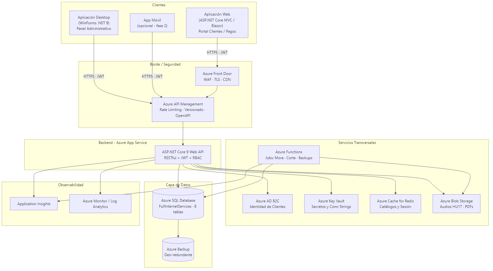
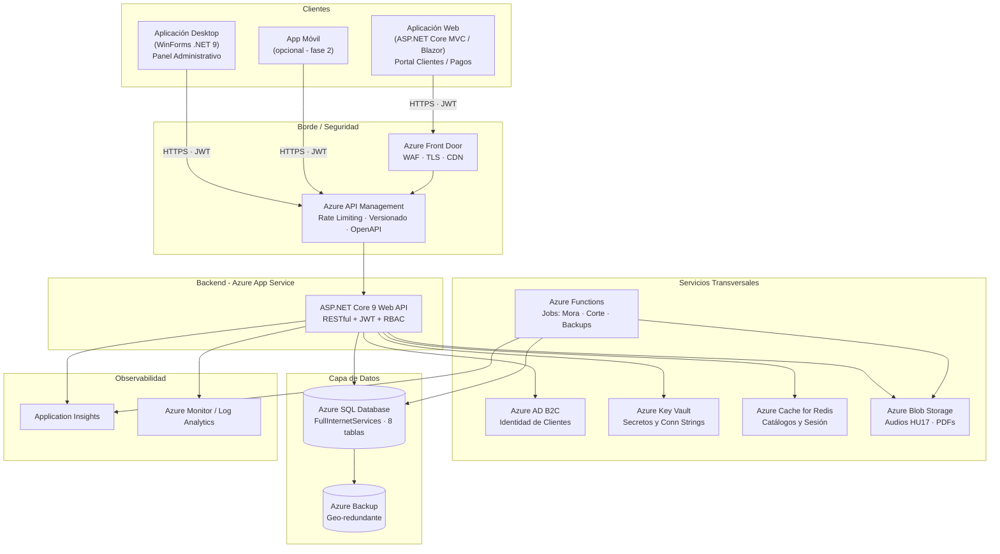
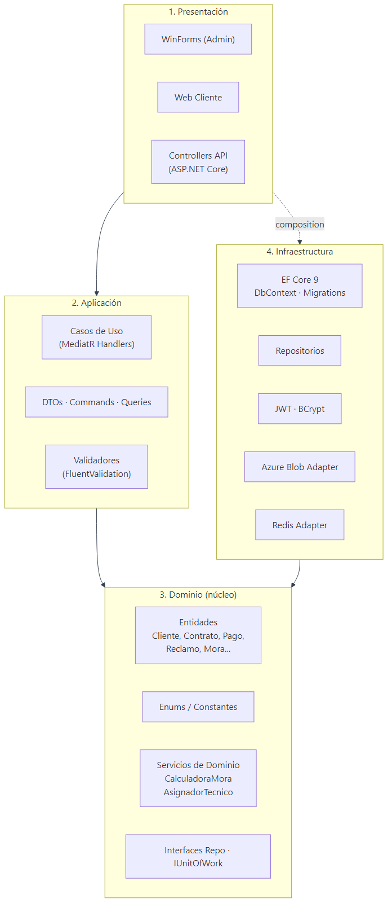
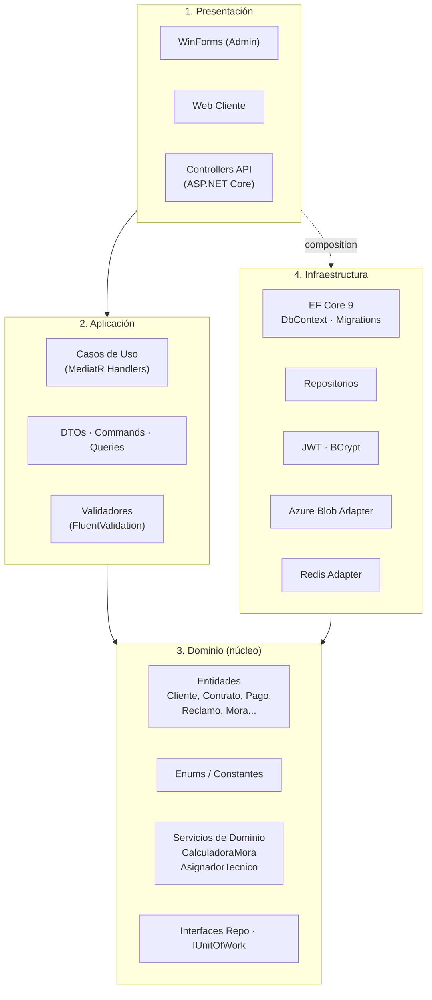
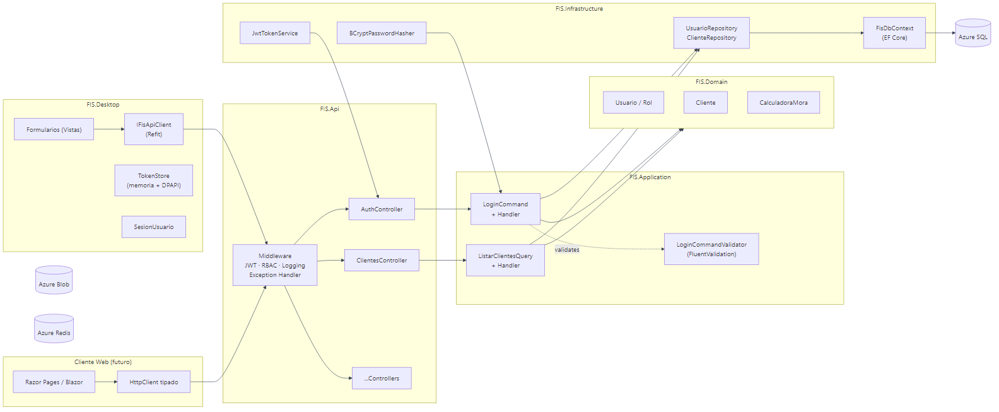
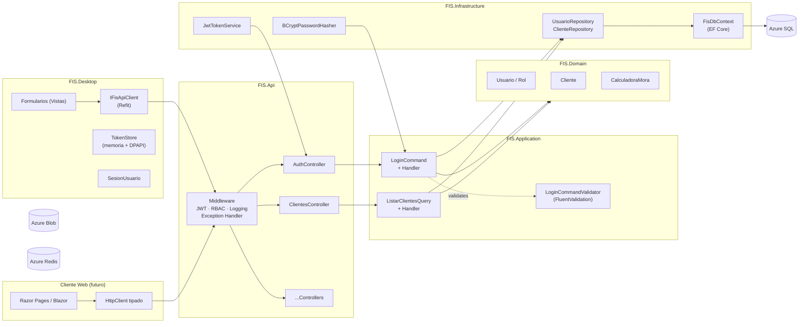
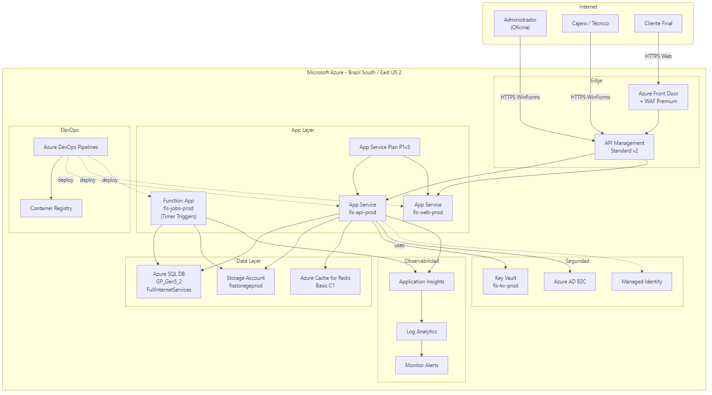
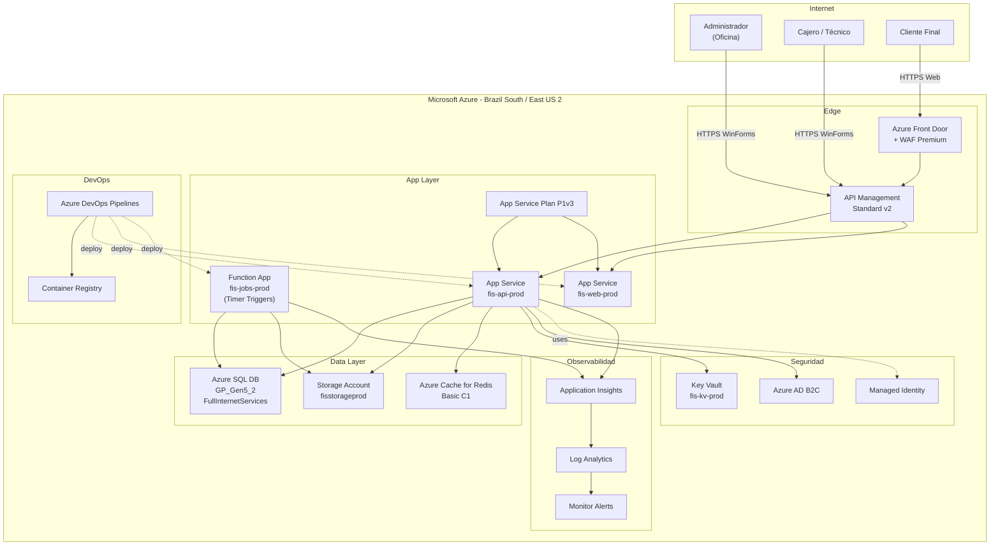
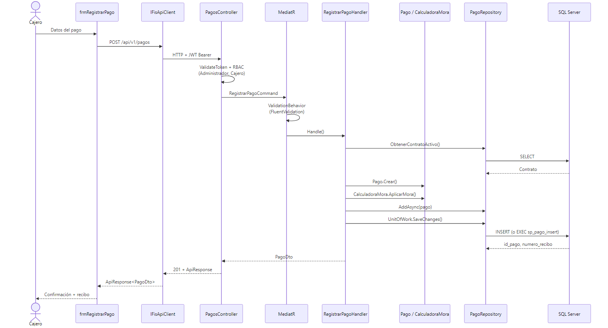
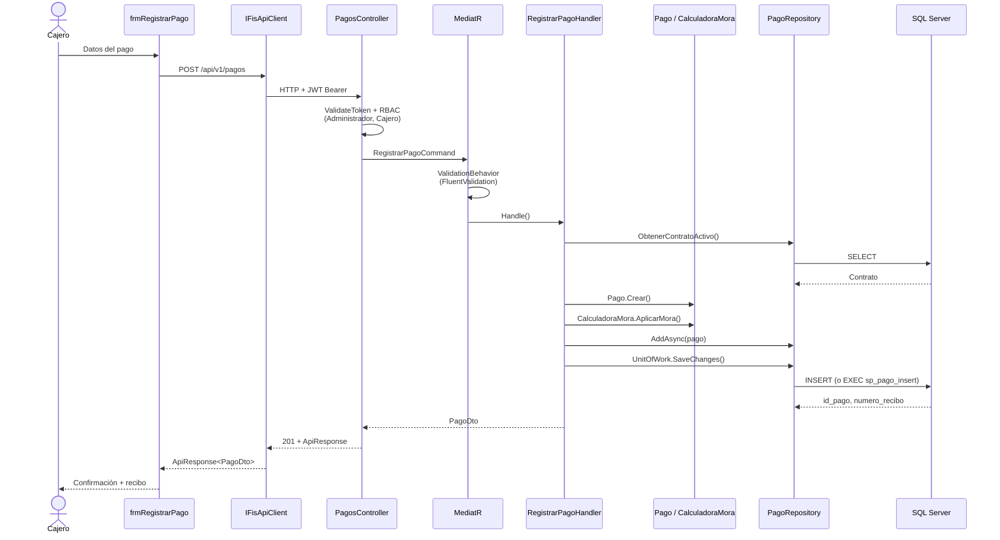

# 01 — Arquitectura

Esta sección documenta la arquitectura completa de la solución desde cuatro vistas complementarias: alto nivel, capas, componentes y despliegue.

---

## 1.1 Vista de Alto Nivel (Cliente-Servidor)

El sistema sigue el patrón **Cliente-Servidor** clásico, con la API REST como **único punto de acceso a la base de datos** (sección 3.5.8 del PDF: "intermediario obligatorio").

Ver fuente Mermaid

### Decisiones clave

- **API REST como único punto de acceso a datos** → cumple RNF02 (RBAC) y RNF07 (cifrado).
- **API Management** delante del App Service para versionado, throttling y políticas.
- **Front Door + WAF** únicamente para tráfico web público (portal de clientes).
- Los WinForms hablan directamente con APIM (red privada o internet con TLS).

---

## 1.2 Arquitectura por Capas (Clean Architecture)

Ver fuente Mermaid

### Reglas de dependencia

1. `Presentación` → `Aplicación` → `Dominio` (flujo principal).
2. `Infraestructura` depende de `Dominio` (implementa sus interfaces — Inversión de Dependencia).
3. **El Dominio no depende de nadie**: no conoce EF, ni HTTP, ni Azure. Esto se refleja en `FIS.Domain.csproj`, que **no tiene `<PackageReference>` a nada externo**.
4. Los **DTOs viajan entre Presentación y Aplicación**; las **Entidades nunca salen del Dominio**.

### Mapeo proyecto → capa

| Capa | Proyecto |
|---|---|
| Presentación (API + Desktop) | `FIS.Api`, `FIS.Desktop` |
| Aplicación | `FIS.Application` |
| Dominio | `FIS.Domain` |
| Infraestructura | `FIS.Infrastructure` |
| Contratos compartidos | `FIS.Contracts` |

---

## 1.3 Diagrama de Componentes

Detalle de los componentes runtime y sus interacciones, incluyendo los repositorios, el pipeline de MediatR y los adaptadores de infraestructura.

Ver fuente Mermaid

---

## 1.4 Diagrama de Despliegue (Azure)

Vista física de la solución desplegada en producción.

Ver fuente Mermaid

Detalle de servicios Azure y SKUs en [05-cloud-azure](../05-cloud-azure/README.md).

---

## 1.5 Flujo de una Operación Típica

Ejemplo: registrar un pago desde la app de escritorio.

Ver fuente Mermaid

---

## Referencias del PDF

| Sección PDF | Diagrama |
|---|---|
| 3.5 — Arquitectura de la Solución | 1.1, 1.2 |
| 3.5.5 — Representación Conceptual | 1.1 |
| 3.5.6 — Descripción Detallada de Capas | 1.2 |
| 3.5.7 — Flujo de Funcionamiento | 1.5 |
| 3.12 — Modelo de Despliegue | 1.4 (adaptado a Azure) |
