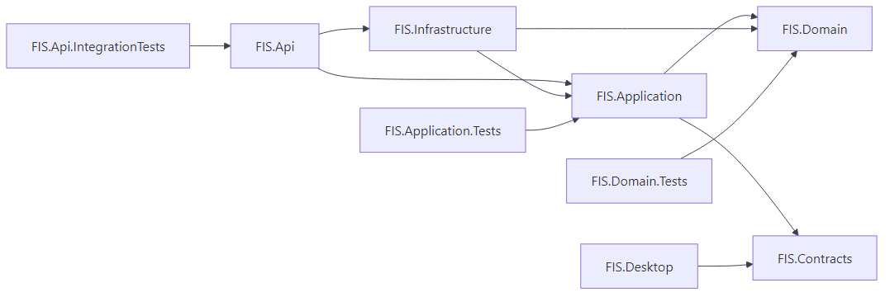
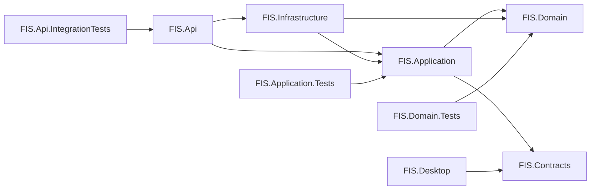
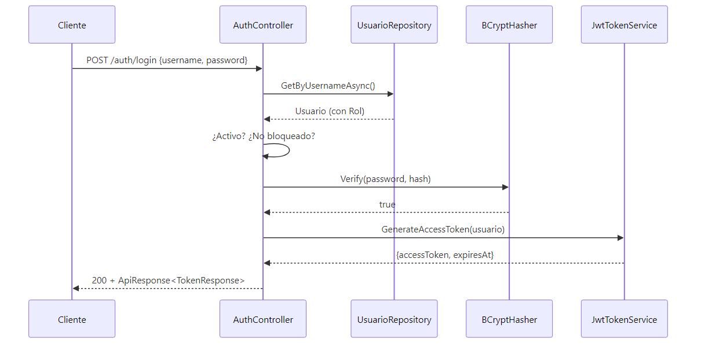
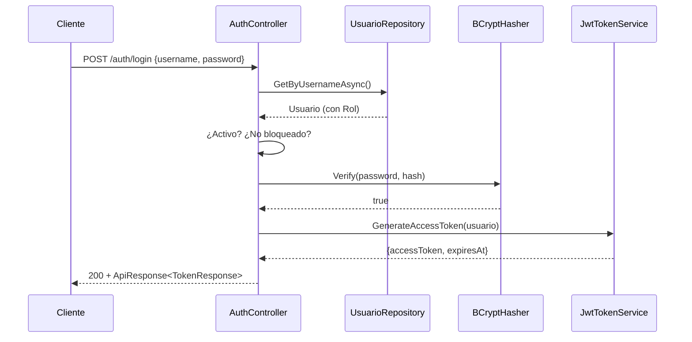
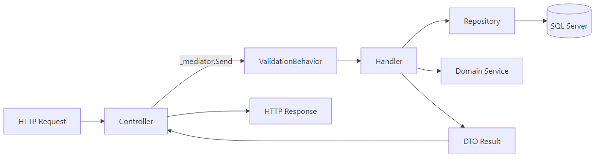
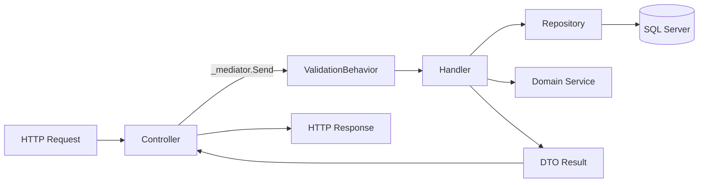

# 02 — Backend (ASP.NET Core 9 + EF Core)

Documenta la implementación del backend: estructura de proyectos, endpoints REST, autenticación, RBAC, estrategia de persistencia y patrones aplicados.

---

## 2.1 Estructura de Proyectos



<details>
<summary>Ver fuente Mermaid</summary>



</details>

| Proyecto | Rol | TFM |
|---|---|---|
| `FIS.Api` | Capa de Presentación HTTP — Controllers, middleware, Swagger. | `net9.0` |
| `FIS.Application` | Casos de uso, comandos/queries, validadores. | `net9.0` |
| `FIS.Domain` | Núcleo: entidades, enums, servicios de dominio. | `net9.0` |
| `FIS.Infrastructure` | EF Core, repositorios, JWT, BCrypt, adapters. | `net9.0` |
| `FIS.Contracts` | DTOs compartidos (API ↔ Desktop ↔ Web). | `net9.0` |
| `FIS.Desktop` | Cliente WinForms. | `net9.0-windows` |
| `FIS.*.Tests` | xUnit + FluentAssertions + Microsoft.AspNetCore.Mvc.Testing. | `net9.0` |

---

## 2.2 Estructura de Carpetas dentro de FIS.Api

```
FIS.Api/
├── Controllers/
│   ├── AuthController.cs           ← Login (HU01)
│   ├── ClientesController.cs       ← Endpoint protegido demo (HU03)
│   └── ... (futuros: Pagos, Reclamos, Contratos)
├── Identity/
│   └── CurrentUserService.cs       ← Resuelve usuario desde JWT
├── Middleware/
│   ├── ExceptionHandlingMiddleware.cs
│   └── ValidationBehavior.cs       ← Pipeline de MediatR
├── Program.cs                      ← Bootstrap + DI + JWT + Swagger
├── appsettings.json
└── appsettings.Development.json
```

---

## 2.3 Endpoints REST (PoC actual + diseño completo)

| Versión | Verbo | Ruta | Roles | RF / HU |
|---|---|---|---|---|
| v1 | POST | `/api/v1/auth/login` | público | HU01 |
| v1 | POST | `/api/v1/auth/refresh` | autenticado | RNF02 |
| v1 | POST | `/api/v1/auth/biometrico` | público | HU01 |
| v1 | GET | `/api/v1/clientes` | Admin, Cajero | HU03 |
| v1 | POST | `/api/v1/clientes` | Admin, Cajero | HU03 |
| v1 | GET | `/api/v1/clientes/{id}` | Admin, Cajero | HU03 |
| v1 | PUT | `/api/v1/clientes/{id}` | Admin, Cajero | HU03 |
| v1 | DELETE | `/api/v1/clientes/{id}` | Admin | RNF11 |
| v1 | POST | `/api/v1/contratos` | Admin, Cajero | HU05 |
| v1 | POST | `/api/v1/pagos` | Admin, Cajero | HU07 |
| v1 | POST | `/api/v1/pagos/{id}/anular` | Admin | HU09 |
| v1 | GET | `/api/v1/reportes/mora` | Admin | HU20 |
| v1 | POST | `/api/v1/reclamos` | Admin, Cajero | HU14 |
| v1 | POST | `/api/v1/reclamos/{id}/asignar` | Admin | HU15 |
| v1 | PATCH | `/api/v1/reclamos/{id}/cerrar` | Admin, Técnico | HU16 |

> Marcados en **negrita** los endpoints implementados como **PoC vertical** en este repositorio.

### Implementados como PoC vertical
- **POST `/api/v1/auth/login`** → emite JWT.
- **GET `/api/v1/clientes`** → listado paginado, requiere rol Admin/Cajero.
- **GET `/api/v1/clientes/admin-only`** → demo de RBAC, requiere rol Admin.

---

## 2.4 Autenticación y Autorización (RBAC)

### Flujo de autenticación



<details>
<summary>Ver fuente Mermaid</summary>



</details>

### Política RBAC

| Rol | Permisos |
|---|---|
| **Administrador** | Todo (CRUD usuarios, anular pagos, gestión integral, reportes ejecutivos) |
| **Cajero** | Clientes (CRUD), contratos (crear/leer), pagos (registrar), no anula |
| **Técnico** | Reclamos asignados (lectura, cambiar estado, registrar solución, audio) |
| **Cliente** | Su propio perfil, sus pagos, abrir reclamos web |

Implementación en C#:

```csharp
[Authorize(Roles = $"{Roles.Administrador},{Roles.Cajero}")]
public async Task<IActionResult> Listar(...) { ... }

[Authorize(Roles = Roles.Administrador)]
public IActionResult SoloAdmin() => Ok(...);
```

### Bloqueo por intentos fallidos (RNF06)

La entidad `Usuario` encapsula la lógica:

```csharp
public void RegistrarIntentoFallido()
{
    IntentosFallidos++;
    if (IntentosFallidos >= 5)
        BloqueadoHasta = DateTime.UtcNow.AddMinutes(30);
}
```

---

## 2.5 CQRS con MediatR

Cada caso de uso se modela como Command (mutación) o Query (lectura), con su Handler y opcionalmente su Validator.



<details>
<summary>Ver fuente Mermaid</summary>



</details>

### Estructura por feature
```
FIS.Application/
├── Auth/
│   └── Login/
│       ├── LoginCommand.cs
│       ├── LoginCommandHandler.cs
│       └── LoginCommandValidator.cs
├── Clientes/
│   ├── Commands/
│   │   ├── CrearClienteCommand.cs
│   │   └── ...
│   └── Queries/
│       └── ListarClientesQuery.cs
└── Pagos/
    ├── Commands/RegistrarPagoCommand.cs
    └── Queries/...
```

---

## 2.6 Persistencia con EF Core 9

### Estrategia híbrida

| Operación | Mecanismo |
|---|---|
| CRUD básico (Cliente, Plan, Rol) | EF Core con LINQ |
| Reglas atómicas (registrar pago + recargo + numeración) | Llamada al SP `sp_pago_insert` desde EF (`Database.SqlQuery`) |
| Auditoría (Bitácora) | Triggers SQL existentes (transparente para C#) |
| Reportes pesados | Vistas SQL + EF `FromSqlRaw` |

### Configuración Fluent API

Cada entidad tiene su `IEntityTypeConfiguration<T>` en `FIS.Infrastructure/Persistence/Configurations/`. Mapean **uno-a-uno** al DDL de `db/db.sql`:

```csharp
public class ClienteConfiguration : IEntityTypeConfiguration<Cliente>
{
    public void Configure(EntityTypeBuilder<Cliente> b)
    {
        b.ToTable("CLIENTE", t =>
            t.HasCheckConstraint("CK_CLIENTE_tipo", "tipo_cliente IN ('N','J')"));
        b.HasIndex(x => x.NitCi).IsUnique().HasDatabaseName("IX_CLIENTE_nit");
        // ... (mapeo completo de columnas y restricciones)
    }
}
```

### Repositorios

Patrón **Repository + Unit of Work**, con `FisDbContext` implementando `IUnitOfWork`. Las interfaces viven en `FIS.Domain.Interfaces` (Inversión de Dependencia).

---

## 2.7 Manejo Centralizado de Errores

`ExceptionHandlingMiddleware` traduce excepciones a respuestas HTTP coherentes:

| Excepción | HTTP | Cuerpo |
|---|---|---|
| `ValidationException` (FluentValidation) | 400 | `ApiResponse.ValidationFail(errors)` |
| `BusinessException` (dominio) | 422 | `ApiResponse.Fail(message, code)` |
| `UnauthorizedAccessException` | 401 | `ApiResponse.Fail("No autorizado")` |
| `Exception` (genérica) | 500 | `ApiResponse.Fail("Error interno")` (mensaje sanitizado) |

---

## 2.8 Versionado de API

Esquema **URL-segment** (`/api/v1/...`) usando el paquete `Asp.Versioning.Mvc`. Configurado en `Program.cs`:

```csharp
builder.Services.AddApiVersioning(opt =>
{
    opt.DefaultApiVersion = new ApiVersion(1, 0);
    opt.AssumeDefaultVersionWhenUnspecified = true;
    opt.ReportApiVersions = true;
}).AddApiExplorer(opt =>
{
    opt.GroupNameFormat = "'v'VVV";
    opt.SubstituteApiVersionInUrl = true;
});
```

Detalle en [07-mejoras/versionado-api](../07-mejoras/README.md#33-versionado-de-api).

---

## 2.9 Logging y Observabilidad

- **Serilog** como provider, con sinks Console (Dev) y Application Insights + Blob Storage (Prod).
- `UseSerilogRequestLogging()` registra cada petición HTTP con duración, status code y traceId.
- Configuración por ambiente vía `appsettings.{Environment}.json`.

---

## 2.10 Cómo Probar la PoC

```powershell
# 1. Arrancar el API
dotnet run --project src/FIS.Api

# 2. Login (con admin/Admin123*)
curl -X POST https://localhost:7001/api/v1/auth/login `
  -H "Content-Type: application/json" `
  -d '{"username":"admin","password":"Admin123*"}'

# Respuesta:
# {
#   "success": true,
#   "data": {
#     "accessToken": "eyJhbGciOi...",
#     "expiresAt": "2026-04-29T13:47:25Z",
#     "user": { "username": "admin", "rol": "Administrador" }
#   }
# }

# 3. Llamar al endpoint protegido
curl https://localhost:7001/api/v1/clientes `
  -H "Authorization: Bearer eyJhbGciOi..."

# 4. Verificar RBAC (rol distinto → 403)
curl https://localhost:7001/api/v1/clientes/admin-only `
  -H "Authorization: Bearer <token-de-cajero>"
# 403 Forbidden
```

O simplemente abre **Swagger UI** en `https://localhost:7001/swagger` y usa el botón "Authorize".

---

## Referencias del PDF

| Sección PDF | Tema |
|---|---|
| 3.4 RNF02 | RBAC |
| 3.4 RNF06 | Bloqueo por intentos |
| 3.5.6 — Capa de Lógica de Negocio | CQRS, Servicios de Dominio |
| 3.5.6 — Capa de Acceso a Datos | Repositorios, EF Core, SPs |
| 3.10 — Stored Procedures | sp_pago_insert, sp_cliente_insert |
