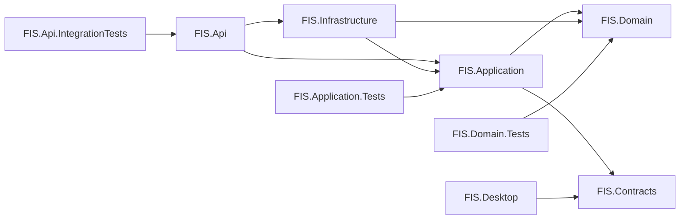
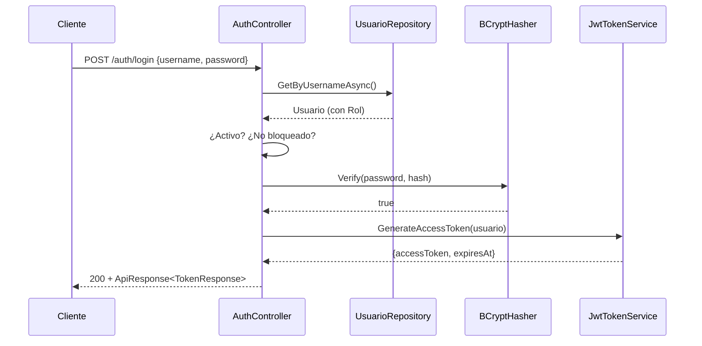
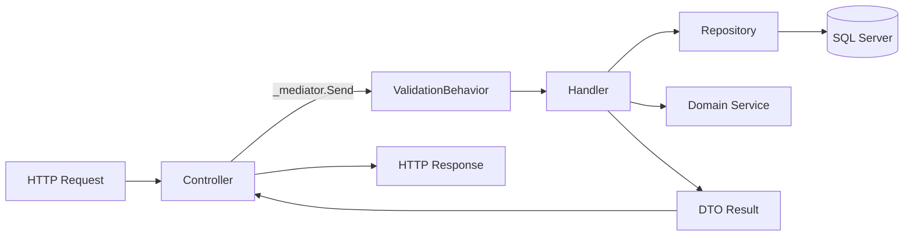

# 02 — Backend (ASP.NET Core 9 + EF Core)

Documenta la implementación completa del backend: estructura de proyectos, todos los endpoints REST, autenticación, RBAC, estrategia de persistencia y patrones aplicados.

---

## 2.1 Estructura de Proyectos


<details>
<summary>Ver fuente Mermaid</summary>



</details>

| Proyecto | Rol | TFM |
|---|---|---|
| `FIS.Api` | Capa de Presentación HTTP — Controllers, middleware, Swagger. | `net9.0` |
| `FIS.Application` | Casos de uso, comandos/queries, validadores. | `net9.0` |
| `FIS.Domain` | Núcleo: entidades, enums, servicios de dominio. | `net9.0` |
| `FIS.Infrastructure` | EF Core, repositorios, JWT, BCrypt, adapters, ReporteService. | `net9.0` |
| `FIS.Contracts` | DTOs compartidos (API ↔ Desktop ↔ Web). | `net9.0` |
| `FIS.Desktop` | Cliente WinForms — 12 formularios. | `net9.0-windows` |
| `FIS.*.Tests` | xUnit + FluentAssertions + Microsoft.AspNetCore.Mvc.Testing. | `net9.0` |

---

## 2.2 Estructura de Carpetas dentro de FIS.Api

```
FIS.Api/
├── Controllers/
│   ├── AuthController.cs           ← Login (RF01 / HU01)
│   ├── ClientesController.cs       ← CRUD clientes (RF02)
│   ├── PlanesController.cs         ← CRUD planes y servicios (RF03, RF04)
│   ├── ContratosController.cs      ← Registro y estado de contratos (RF05)
│   ├── PagosController.cs          ← Pagos y anulación (RF06, RF07)
│   ├── ReclamosController.cs       ← Soporte técnico (RF09-RF13)
│   ├── UsuariosController.cs       ← Gestión de usuarios y roles (RF16)
│   └── ReportesController.cs       ← Reportes + bitácora (RF14, RF15, RF17)
├── Identity/
│   └── CurrentUserService.cs       ← Resuelve usuario desde JWT
├── Middleware/
│   ├── ExceptionHandlingMiddleware.cs
│   └── ValidationBehavior.cs       ← Pipeline de MediatR
├── Program.cs                      ← Bootstrap + DI + JWT + Swagger + Seeder
├── appsettings.json
└── appsettings.Development.json
```

---

## 2.3 Endpoints REST — Implementación Completa

### Autenticación
| Verbo | Ruta | Roles | RF |
|---|---|---|---|
| POST | `/api/v1/auth/login` | público | RF01 |

### Clientes (RF02)
| Verbo | Ruta | Roles | Descripción |
|---|---|---|---|
| GET | `/api/v1/clientes` | Admin, Cajero | Lista paginada con filtro |
| GET | `/api/v1/clientes/{id}` | Admin, Cajero | Obtener por ID |
| POST | `/api/v1/clientes` | Admin | Crear cliente |
| PUT | `/api/v1/clientes/{id}` | Admin | Actualizar datos |
| DELETE | `/api/v1/clientes/{id}` | Admin | Desactivar (lógico) |

### Planes de Servicio (RF03, RF04)
| Verbo | Ruta | Roles | Descripción |
|---|---|---|---|
| GET | `/api/v1/planes` | público | Lista de planes activos |
| POST | `/api/v1/planes` | Admin | Crear plan |
| PUT | `/api/v1/planes/{id}` | Admin | Actualizar plan |
| DELETE | `/api/v1/planes/{id}` | Admin | Desactivar plan |

### Contratos (RF05)
| Verbo | Ruta | Roles | Descripción |
|---|---|---|---|
| GET | `/api/v1/contratos` | Admin, Cajero | Lista paginada |
| POST | `/api/v1/contratos` | Admin | Registrar contrato |
| PATCH | `/api/v1/contratos/{id}/estado` | Admin | Suspender / Reactivar / Finalizar |

### Pagos (RF06, RF07, RF08)
| Verbo | Ruta | Roles | Descripción |
|---|---|---|---|
| GET | `/api/v1/pagos` | Admin, Cajero | Lista paginada |
| POST | `/api/v1/pagos` | Admin, Cajero | Registrar pago (detecta mora día 12) |
| POST | `/api/v1/pagos/anular` | Admin | Anular pago con motivo |

### Reclamos / Soporte Técnico (RF09-RF13)
| Verbo | Ruta | Roles | Descripción |
|---|---|---|---|
| GET | `/api/v1/reclamos` | Admin, Técnico | Lista con filtro por estado/técnico |
| POST | `/api/v1/reclamos` | Admin, Técnico | Registrar reclamo |
| PATCH | `/api/v1/reclamos/{id}/tecnico` | Admin | Asignar técnico (límite 5 activos) |
| PATCH | `/api/v1/reclamos/{id}/estado` | Admin, Técnico | Cambiar estado / registrar solución |

### Usuarios (RF16)
| Verbo | Ruta | Roles | Descripción |
|---|---|---|---|
| GET | `/api/v1/usuarios` | Admin | Listar todos los usuarios |
| POST | `/api/v1/usuarios` | Admin | Crear usuario con rol |

### Reportes (RF14, RF15, RF17)
| Verbo | Ruta | Roles | Descripción |
|---|---|---|---|
| GET | `/api/v1/reportes/mora` | Admin | Clientes con mora activa (día > 12) |
| GET | `/api/v1/reportes/ventas?anio=2026` | Admin | Contratos e ingresos por mes |
| GET | `/api/v1/reportes/tecnicos` | Admin | % resolución y calificación por técnico |
| GET | `/api/v1/reportes/bitacora` | Admin | Bitácora de operaciones paginada (RF17) |

---

## 2.4 Autenticación y Autorización (RBAC)

### Flujo de autenticación


<details>
<summary>Ver fuente Mermaid</summary>



</details>

### Política RBAC

| Rol | Permisos |
|---|---|
| **Administrador** | Todo: CRUD usuarios, anular pagos, asignar técnicos, gestión integral, todos los reportes |
| **Cajero** | Clientes (CRUD), contratos (leer/crear), pagos (registrar), reclamos (leer) |
| **Técnico** | Reclamos asignados (leer, cambiar estado, registrar solución) |
| **Cliente** | Su propio perfil (Fase 2 — plataforma web) |

```csharp
// Ejemplo de doble restricción en un solo controller
[Authorize(Roles = $"{Roles.Administrador},{Roles.Cajero}")]
public async Task<IActionResult> Listar(...) { ... }

[Authorize(Roles = Roles.Administrador)]
public async Task<IActionResult> Anular(...) { ... }
```

### Bloqueo por intentos fallidos (RNF06)

La entidad `Usuario` encapsula la lógica:

```csharp
public void RegistrarIntentoFallido()
{
    IntentosFallidos++;
    if (IntentosFallidos >= 5)
        BloqueadoHasta = DateTime.UtcNow.AddMinutes(30);
}
```

---

## 2.5 CQRS con MediatR

Cada caso de uso se modela como **Command** (mutación) o **Query** (lectura), con su Handler y opcionalmente su Validator (FluentValidation).


<details>
<summary>Ver fuente Mermaid</summary>



</details>

### Handlers implementados

```
FIS.Application/
├── Auth/Login/
│   ├── LoginCommand.cs + Handler + Validator
├── Clientes/
│   ├── Commands/ CrearClienteCommand, ActualizarClienteCommand, DesactivarClienteCommand
│   └── Queries/  ListarClientesQuery, ObtenerClienteQuery
├── Planes/
│   ├── Commands/ CrearPlanCommand, ActualizarPlanCommand, DesactivarPlanCommand
│   └── Queries/  ListarPlanesQuery
├── Contratos/
│   ├── Commands/ RegistrarContratoCommand, CambiarEstadoContratoCommand
│   └── Queries/  ListarContratosQuery
├── Pagos/
│   ├── Commands/ RegistrarPagoCommand, AnularPagoCommand
│   └── Queries/  ListarPagosQuery
├── Reclamos/
│   ├── Commands/ RegistrarReclamoCommand, AsignarTecnicoCommand, CambiarEstadoReclamoCommand
│   └── Queries/  ListarReclamosQuery
├── Usuarios/
│   ├── Commands/ CrearUsuarioCommand
│   └── Queries/  ListarUsuariosQuery
└── Reportes/Queries/
    ├── ReporteMoraQuery, ReporteVentasQuery, ReporteTecnicosQuery, BitacoraQuery
```

---

## 2.6 Persistencia con EF Core 9

### Estrategia híbrida

| Operación | Mecanismo |
|---|---|
| CRUD básico (Clientes, Planes, Roles) | EF Core con LINQ |
| Reglas atómicas (pago + numeración + mora) | Lógica en Handler + UoW |
| Reportes con joins complejos | `IReporteService` → EF LINQ con Include |
| Auditoría (Bitácora) | Triggers SQL + entidad `BitacoraOperacion` (read-only desde API) |

### Configuración Fluent API

Cada entidad tiene su `IEntityTypeConfiguration<T>` en `Configurations/`. Las 9 configuraciones activas:

| Clase de configuración | Tabla SQL |
|---|---|
| `RolConfiguration` | `dbo.ROL` |
| `UsuarioConfiguration` | `dbo.USUARIO` |
| `ClienteConfiguration` | `dbo.CLIENTE` |
| `PlanServicioConfiguration` | `dbo.PLAN_SERVICIO` |
| `ContratoConfiguration` | `dbo.CONTRATO` |
| `PagoConfiguration` | `dbo.PAGO` |
| `MoraConfiguration` | `dbo.MORA` |
| `ReclamoConfiguration` | `dbo.RECLAMO` |
| `BitacoraConfiguration` | `dbo.BITACORA` (migración `AddBitacora`) |

### Repositorios

| Interfaz | Implementación | Responsabilidad |
|---|---|---|
| `IUsuarioRepository` | `UsuarioRepository` | Auth + gestión usuarios |
| `IClienteRepository` | `ClienteRepository` | CRUD clientes con paginación |
| `IPlanRepository` | `PlanRepository` | CRUD planes |
| `IContratoRepository` | `ContratoRepository` | Contratos + numeración automática |
| `IPagoRepository` | `PagoRepository` | Pagos + numeración de recibo |
| `IReclamoRepository` | `ReclamoRepository` | Reclamos + conteo por técnico |
| `IReporteService` | `ReporteService` | Consultas analíticas (mora, ventas, técnicos, bitácora) |

---

## 2.7 Seeder de Datos de Demostración

Al arrancar en `Development`, el `DemoDataSeeder` inserta:

| Entidad | Cant. | Descripción |
|---|---|---|
| Roles | 4 | Administrador, Cajero, Tecnico, Cliente |
| Usuarios | 6 | admin, cajero1, cajero2, tecnico1, tecnico2, tecnico3 |
| Clientes | 12 | Naturales y jurídicos (Cochabamba, La Paz, Santa Cruz…) |
| Planes | 8 | Internet 10/25/50/100 Mbps, Fibra 200 Mbps, Hosting, Dominio |
| Contratos | 12 | Activos, finalizados y suspendidos |
| Pagos | 20+ | Normales, con mora (10%) y un pago anulado |
| Reclamos | 8 | Estados: Recepcionado / En Proceso / Observado / Cerrado |

---

## 2.8 Manejo Centralizado de Errores

`ExceptionHandlingMiddleware` traduce excepciones a respuestas HTTP coherentes:

| Excepción | HTTP | Cuerpo |
|---|---|---|
| `ValidationException` (FluentValidation) | 400 | `ApiResponse.ValidationFail(errors)` |
| `BusinessException` (dominio) | 422 | `ApiResponse.Fail(message, code)` |
| `UnauthorizedAccessException` | 401 | `ApiResponse.Fail("No autorizado")` |
| `Exception` (genérica) | 500 | `ApiResponse.Fail("Error interno")` |

---

## 2.9 Versionado de API

Esquema **URL-segment** (`/api/v1/...`) usando `Asp.Versioning.Mvc`. La versión `v1` contiene todos los endpoints actuales.

---

## 2.10 Logging y Observabilidad

- **Serilog** con sinks Console (Dev) y Application Insights + Blob Storage (Prod).
- `UseSerilogRequestLogging()` registra duración, status code y traceId de cada petición.
- Configuración por ambiente vía `appsettings.{Environment}.json`.

---

## 2.11 Cómo Probar la API

```powershell
# 1. Arrancar el API
dotnet run --project src/FIS.Api

# 2. Abrir Swagger
# https://localhost:7001/swagger
# Usa "Authorize" → Bearer <token>

# 3. Login
curl -X POST https://localhost:7001/api/v1/auth/login `
  -H "Content-Type: application/json" `
  -d '{"username":"admin","password":"Admin123*"}'

# 4. Consultar clientes
curl https://localhost:7001/api/v1/clientes -H "Authorization: Bearer <token>"

# 5. Crear un plan
curl -X POST https://localhost:7001/api/v1/planes `
  -H "Authorization: Bearer <token>" `
  -H "Content-Type: application/json" `
  -d '{"nombrePlan":"Plan Nuevo","tipoServicio":"Internet","velocidadBajadaMbps":30,"precioMensual":220}'

# 6. Reporte de mora
curl https://localhost:7001/api/v1/reportes/mora -H "Authorization: Bearer <token>"
```

---

## Referencias del PDF

| Sección PDF | Tema |
|---|---|
| 3.1 RF01-RF18 | Todos los requerimientos funcionales |
| 3.2 RNF01-RNF14 | Requerimientos no funcionales |
| 3.4 HU01-HU22 | Historias de usuario mapeadas a endpoints |
| 3.5.6 — Capa de Lógica de Negocio | CQRS, MediatR, Servicios de Dominio |
| 3.5.6 — Capa de Acceso a Datos | Repositorios, EF Core, SPs |
| 3.10 — Stored Procedures | sp_pago_insert, sp_cliente_insert |
