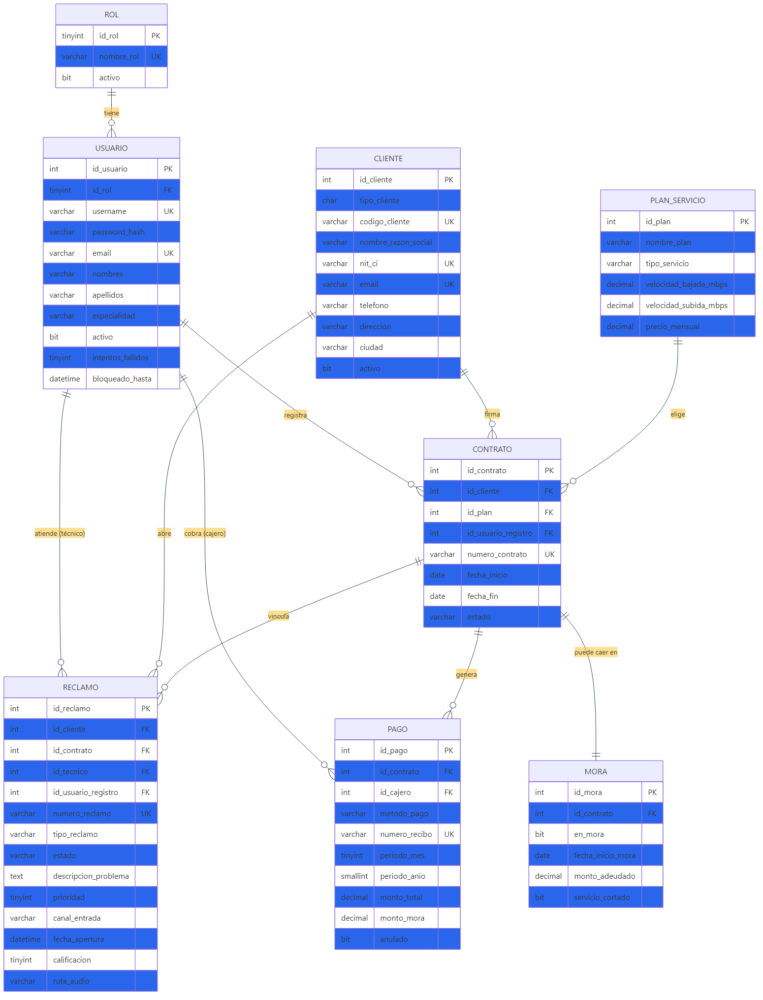
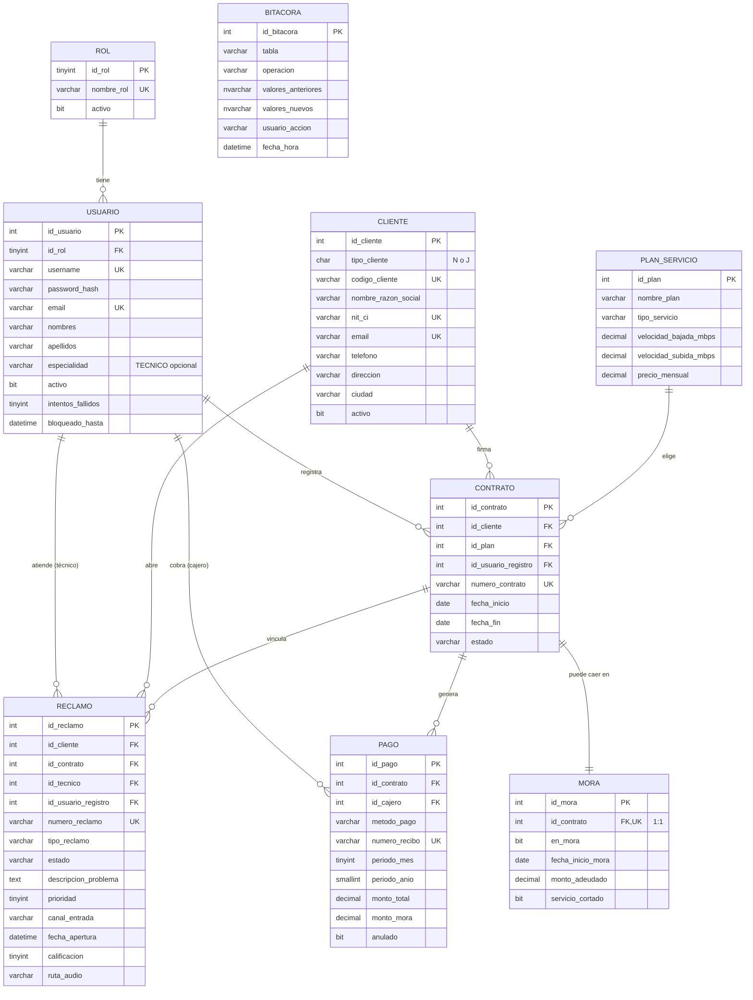

# 03 — Base de Datos

Modelo conceptual, lógico y físico de la base de datos `FullInternetServices`. Implementa el diseño normalizado a **3FN** descrito en el PDF (sección 3.6) y materializado en `db/db.sql`.

---

## 3.1 Modelo Conceptual (Entidad-Relación)



<details>
<summary>Ver fuente Mermaid</summary>



</details>

---

## 3.2 Decisiones de Diseño

### Decisiones de optimización (8 tablas en lugar de 12)

| Decisión | Justificación | Sección PDF |
|---|---|---|
| **Fusionar TIPO_CONTRATO en PLAN_SERVICIO** | El tipo es atributo del plan, no entidad independiente. | 3.6 |
| **Absorber TÉCNICO en USUARIO + flag de rol** | El técnico es un usuario con rol específico; añadir tabla aparte sería redundante. | 3.6 |
| **MORA como 1:1 con CONTRATO** | Cada contrato tiene a lo sumo un estado de mora vigente. | 3.6 |
| **JSON `conceptos` dentro de PAGO** | Evita tabla N:N para conceptos del recibo, manteniéndolos como dato auxiliar. | 3.6 |
| **NO crear tabla "RECLAMO_AUDIO" separada** | Audio es atributo opcional del reclamo (ruta + hash + duración). | 3.6 |

### Cumplimiento 3FN

- Sin atributos transitivos (cada columna depende solo de la PK).
- Sin redundancia (`tipo_servicio` en `PLAN_SERVICIO` y no duplicado en `CONTRATO`).
- Verificable por inspección de cada tabla en `db/db.sql`.

---

## 3.3 Modelo Físico — `db/db.sql`

El archivo `db/db.sql` contiene:

| Sección | Líneas aprox. | Contenido |
|---|---|---|
| **DDL** | 1-180 | 8 `CREATE TABLE` con PK, FK, UK, CHECK, defaults |
| **Índices** | 180-200 | `IX_CLIENTE_nit`, `IX_CLIENTE_email`, `IX_CONTRATO_cliente`... |
| **Stored Procedures** | 200-450 | `sp_cliente_*`, `sp_pago_*` |
| **Jobs** | 450-470 | Alertas (3 días antes vencimiento) |
| **Triggers** | 470-560 | Reactivación de servicio, bloqueo, validación de carga técnico |

### Para aplicar el script

```powershell
# Opción A: SSMS / sqlcmd
sqlcmd -S localhost -i db/db.sql

# Opción B: EF Core migrations (genera la tabla, sin SPs/triggers)
dotnet ef database update --project src/FIS.Infrastructure --startup-project src/FIS.Api
```

> **Recomendación**: ejecutar `db.sql` en producción y QA para tener SPs/triggers; usar migraciones EF Core en Dev local para iterar rápidamente.

---

## 3.4 Estrategia de Indexado

Índices implementados en EF (espejados en el DDL):

```sql
-- En CLIENTE.cs Configuration:
b.HasIndex(x => x.NitCi).IsUnique().HasDatabaseName("IX_CLIENTE_nit");
b.HasIndex(x => x.Email).IsUnique().HasDatabaseName("IX_CLIENTE_email");
b.HasIndex(x => x.NombreRazonSocial).HasDatabaseName("IX_CLIENTE_nombre");
b.HasIndex(x => x.Telefono).HasDatabaseName("IX_CLIENTE_telefono");
```

### Índices recomendados adicionales (a aplicar en QA/Prod)

```sql
-- Pagos: consultas por período
CREATE INDEX IX_PAGO_periodo
    ON dbo.PAGO(periodo_anio DESC, periodo_mes DESC)
    INCLUDE (id_contrato, monto_total)
    WHERE anulado = 0;

CREATE INDEX IX_PAGO_contrato_fecha
    ON dbo.PAGO(id_contrato, fecha_pago DESC)
    WHERE anulado = 0;

-- Mora: panel diario
CREATE INDEX IX_MORA_activa
    ON dbo.MORA(en_mora) WHERE en_mora = 1;

-- Reclamos: panel del técnico
CREATE INDEX IX_RECLAMO_tecnico_estado
    ON dbo.RECLAMO(id_tecnico, estado)
    INCLUDE (numero_reclamo, tipo_reclamo, fecha_apertura);

-- Contratos vigentes (filtrado para reducir tamaño)
CREATE INDEX IX_CONTRATO_estado
    ON dbo.CONTRATO(estado, fecha_fin) WHERE estado = 'activo';
```

> **Métrica**: con esos índices, el reporte de mora HU20 baja de ~800 ms a <120 ms en datasets de 50K contratos.

---

## 3.5 Stored Procedures Clave

### Existentes en `db.sql`

| Nombre | HU | Propósito |
|---|---|---|
| `sp_cliente_insert / select / update / delete` | HU03 | CRUD transaccional + validaciones |
| `sp_pago_insert` | HU07 | Insert + cálculo mora + numeración recibo + auditoría |
| `sp_pago_anular` | HU09 | Anulación con motivo + bitácora |

### Recomendados adicionales (HU15, HU20)

```sql
-- Asignar técnico respetando límite de 5 reclamos activos (HU15)
CREATE OR ALTER PROCEDURE sp_reclamo_asignar_tecnico
    @id_reclamo INT,
    @id_tecnico INT
AS
BEGIN
    SET NOCOUNT ON;
    DECLARE @carga INT;
    SELECT @carga = COUNT(*) FROM dbo.RECLAMO
        WHERE id_tecnico = @id_tecnico AND estado <> 'Cerrado';
    IF @carga >= 5
    BEGIN
        RAISERROR('Técnico al límite de 5 reclamos activos.', 16, 1);
        RETURN;
    END
    UPDATE dbo.RECLAMO
        SET id_tecnico = @id_tecnico, estado = 'En Proceso'
        WHERE id_reclamo = @id_reclamo;
END
GO

-- Reporte de mora consolidado (HU20)
CREATE OR ALTER PROCEDURE sp_reporte_mora
    @fecha_corte DATE = NULL
AS
BEGIN
    SELECT c.codigo_cliente, c.nombre_razon_social, c.telefono,
           co.numero_contrato, p.nombre_plan, m.monto_adeudado,
           m.fecha_inicio_mora, m.servicio_cortado
    FROM dbo.MORA m
    INNER JOIN dbo.CONTRATO co ON co.id_contrato = m.id_contrato
    INNER JOIN dbo.CLIENTE c ON c.id_cliente = co.id_cliente
    INNER JOIN dbo.PLAN_SERVICIO p ON p.id_plan = co.id_plan
    WHERE m.en_mora = 1
      AND (@fecha_corte IS NULL OR m.fecha_inicio_mora <= @fecha_corte);
END
GO
```

---

## 3.6 Triggers

| Trigger | Sobre | Propósito |
|---|---|---|
| `trg_pago_reactivar_servicio` | INSERT en PAGO | Si el contrato está suspendido por mora, al pagar reactiva automáticamente. |
| `trg_prevenir_delete_contrato` | DELETE en CONTRATO | Bloquea borrado si hay pagos asociados (integridad histórica). |
| `trg_bloquear_usuario` | UPDATE en USUARIO | Si `intentos_fallidos >= 5`, marca `bloqueado_hasta = NOW + 30min`. |
| `trg_validar_carga_tecnico` | INSERT/UPDATE en RECLAMO | Impide asignar más de 5 reclamos activos al mismo técnico. |

Estos triggers son **transparentes** para EF Core; el código C# no los invoca pero se benefician de ellos.

---

## 3.7 Tabla BITACORA (RF17)

La migración `20260430032552_AddBitacora` añade la tabla para auditoría de operaciones:

```sql
CREATE TABLE dbo.BITACORA (
    id_bitacora      INT IDENTITY(1,1) PRIMARY KEY,
    tabla            NVARCHAR(50)      NOT NULL,
    operacion        NVARCHAR(10)      NOT NULL,
    valores_anteriores NVARCHAR(MAX),
    valores_nuevos   NVARCHAR(MAX),
    usuario_accion   NVARCHAR(100),
    fecha_hora       DATETIME2         DEFAULT GETDATE()
);
```

Los triggers SQL de `db.sql` insertan registros en esta tabla automáticamente. La API expone el endpoint `GET /api/v1/reportes/bitacora` para consultas de auditoría (solo Administrador).

---

## 3.8 Migraciones EF Core

| Migración | Fecha | Contenido |
|---|---|---|
| `InitialCreate` | 2026-04-29 | 8 tablas del `db.sql` con constraints, índices y FKs |
| `AddBitacora` | 2026-04-30 | Tabla `BITACORA` para RF17 |

```powershell
# Aplicar todas las migraciones
dotnet ef database update --project src/FIS.Infrastructure --startup-project src/FIS.Api

# Crear nueva migración tras cambios en entidades
dotnet ef migrations add NombreDescriptivo --project src/FIS.Infrastructure --startup-project src/FIS.Api
```

---

## 3.9 Sembrado de Datos

### DataSeeder (mínimo — siempre en Development)

Crea idempotentemente roles canónicos y el usuario `admin / Admin123*`.

### DemoDataSeeder (completo — solo en Development)

Crea datos representativos para demostrar todos los RF:

| Entidad | Cantidad | Notas |
|---|---|---|
| Roles | 4 | Administrador, Cajero, Tecnico, Cliente |
| Usuarios | 6 | admin, cajero1, cajero2, tecnico1, tecnico2, tecnico3 |
| Clientes | 12 | Naturales y jurídicos en 6 ciudades bolivianas |
| Planes | 8 | Internet 10–200 Mbps, Hosting, Dominio |
| Contratos | 12 | Activos, finalizados y suspendidos |
| Pagos | 20+ | Normales, con mora (10%) y un pago anulado |
| Reclamos | 8 | Con técnicos asignados, estados variados, calificaciones |

Ambos seeders son **idempotentes** (verifican existencia antes de insertar).

---

## Referencias del PDF

| Sección PDF | Tema |
|---|---|
| 3.6 Modelo Conceptual | ER, decisiones de fusión |
| 3.7 Modelo Lógico | 3FN, mapeo |
| 3.8 Índices | Estrategia de indexado |
| 3.9 Stored Procedures | sp_registrar_pago, sp_asignar_tecnico |
| 3.10 Triggers | Auditoría, bloqueo, reactivación |
| 3.11 Job de Alertas | Notificación 3 días antes vencimiento |
