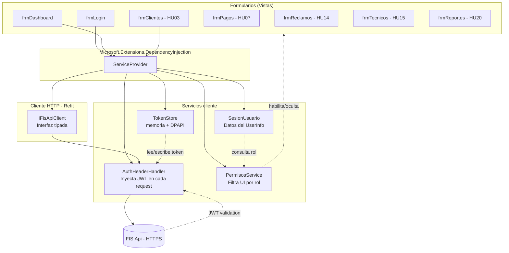
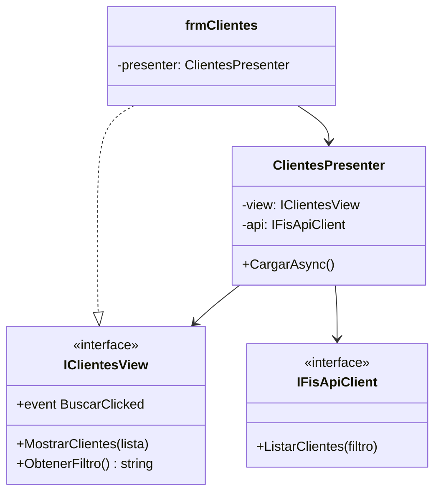
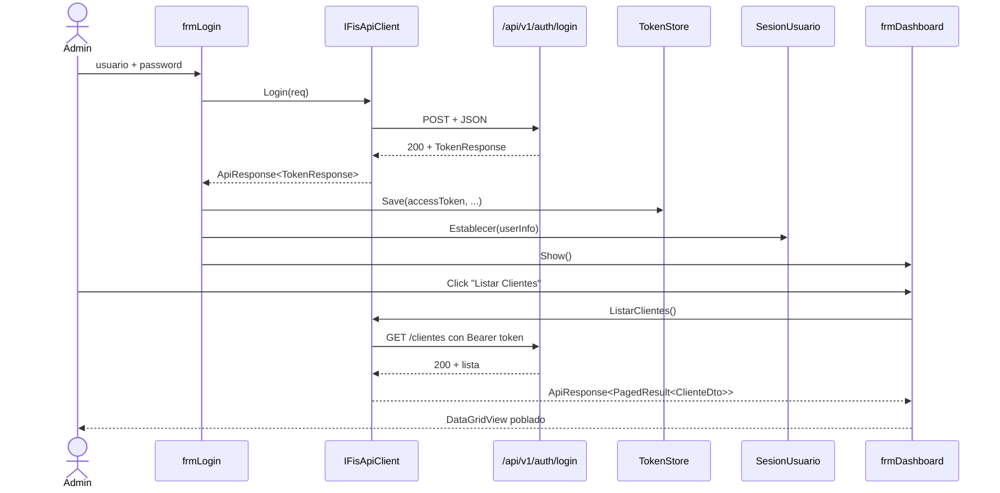

# 04 — Aplicación Desktop (WinForms .NET 9)

Cliente administrativo en WinForms que consume la API REST. Provee a Administrador, Cajero y Técnico una interfaz adaptada a su rol.

---

## 4.1 Arquitectura del Cliente Desktop


<details>
<summary>Ver fuente Mermaid</summary>



</details>

---

## 4.2 Patrón MVP (Model-View-Presenter)

Para evitar lógica en code-behind y facilitar tests:


<details>
<summary>Ver fuente Mermaid</summary>



</details>

> En la PoC actual los formularios `frmLogin` y `frmDashboard` integran lógica directamente para mantener simplicidad. Para módulos con más reglas (Pagos, Reportes) se aplicará MVP completo.

---

## 4.3 Módulos del Panel Administrativo

| Módulo | RF / HU | Roles que acceden | Estado |
|---|---|---|---|
| Login | HU01 | Todos | ✓ Implementado |
| Dashboard | RF01 | Todos | ✓ Implementado (skeleton) |
| Clientes | HU03 | Admin, Cajero | ✓ Listado consumiendo API |
| Planes | HU04 | Admin | Pendiente |
| Contratos | HU05, HU06 | Admin, Cajero | Pendiente |
| Pagos | HU07, HU09 | Admin, Cajero | Pendiente |
| Mora | HU10 | Admin | Pendiente |
| Reclamos | HU14, HU15, HU16 | Admin, Técnico | Pendiente |
| Reportes | HU20, HU21 | Admin | Pendiente |
| Auditoría | HU22 | Admin | Pendiente |

---

## 4.4 Consumo de la API con Refit

### Interfaz tipada

```csharp
public interface IFisApiClient
{
    [Post("/api/v1/auth/login")]
    Task<TokenApiResponse> Login([Body] LoginRequest req);

    [Get("/api/v1/clientes")]
    Task<ClientesApiResponse> ListarClientes(
        [Query] string? filtro,
        [Query] int page = 1,
        [Query] int pageSize = 25);
}
```

### Inyección del JWT — `AuthHeaderHandler`

```csharp
public class AuthHeaderHandler : DelegatingHandler
{
    private readonly TokenStore _tokens;
    public AuthHeaderHandler(TokenStore tokens) => _tokens = tokens;

    protected override Task<HttpResponseMessage> SendAsync(
        HttpRequestMessage request, CancellationToken ct)
    {
        if (!string.IsNullOrEmpty(_tokens.AccessToken))
            request.Headers.Authorization =
                new AuthenticationHeaderValue("Bearer", _tokens.AccessToken);
        return base.SendAsync(request, ct);
    }
}
```

### Bootstrap de DI en `Program.cs`

```csharp
services.AddSingleton<TokenStore>();
services.AddSingleton<SesionUsuario>();
services.AddTransient<AuthHeaderHandler>();

services.AddRefitClient<IFisApiClient>()
    .ConfigureHttpClient(c => c.BaseAddress = new Uri(apiBaseUrl))
    .AddHttpMessageHandler<AuthHeaderHandler>();

services.AddTransient<frmLogin>();
services.AddTransient<frmDashboard>();
```

---

## 4.5 RBAC en la UI

`SesionUsuario` expone propiedades `EsAdministrador`, `EsCajero`, `EsTecnico`. Los formularios las usan para habilitar/ocultar elementos:

```csharp
private void AjustarPorRol()
{
    _btnSoloAdmin.Enabled = _sesion.EsAdministrador;
    _btnAnularPago.Visible = _sesion.EsAdministrador;
    _btnAsignarTecnico.Enabled = _sesion.EsAdministrador;
    _btnRegistrarPago.Enabled = _sesion.EsAdministrador || _sesion.EsCajero;
}
```

> **Doble validación**: la UI **también valida** en backend. Que un cajero no vea el botón de anular pagos no es suficiente; el endpoint `POST /pagos/{id}/anular` requiere `[Authorize(Roles = "Administrador")]`.

---

## 4.6 Almacenamiento Seguro de Tokens

`TokenStore` mantiene los tokens en memoria. Para persistir el refresh token entre sesiones, expone helpers DPAPI:

```csharp
public static string Protect(string plain) =>
    Convert.ToBase64String(ProtectedData.Protect(
        Encoding.UTF8.GetBytes(plain), null,
        DataProtectionScope.CurrentUser));

public static string Unprotect(string encoded) =>
    Encoding.UTF8.GetString(ProtectedData.Unprotect(
        Convert.FromBase64String(encoded), null,
        DataProtectionScope.CurrentUser));
```

> **DPAPI** cifra con la identidad del usuario Windows actual. Otro usuario en la misma máquina no puede descifrar el token.

---

## 4.7 Distribución (Producción)

### MSIX (recomendado para Windows 10/11)
- Empaquetado moderno con auto-update.
- Firma digital con certificado corporativo.
- Distribución vía Microsoft Store / sitio web / SCCM.

### ClickOnce (alternativa rápida)
- Despliegue en URL HTTPS.
- Auto-actualización al iniciar la app.
- Requiere menos configuración pero es legacy.

### Configuración de RID

`<RuntimeIdentifier>win-x64</RuntimeIdentifier>` con `<PublishSingleFile>true</PublishSingleFile>` para un único ejecutable autocontenido (~80 MB).

---

## 4.8 Flujo Login → Dashboard


<details>
<summary>Ver fuente Mermaid</summary>



</details>

---

## 4.9 Cómo Probar

```powershell
# Asume que la API está corriendo en https://localhost:7001
dotnet run --project src/FIS.Desktop

# Login con: admin / Admin123*
# Dashboard:
#   - "Clientes" → consume GET /api/v1/clientes
#   - "Solo Administrador" → consume GET /api/v1/clientes/admin-only
#       → Si haces login con un usuario Cajero, este botón estaría deshabilitado
#         y la API respondería 403 si lo invocaras manualmente.
```

---

## Referencias del PDF

| Sección PDF | Tema |
|---|---|
| RF01-RF18 | Funcionalidades a cubrir en la app |
| 3.5.6 — Capa de Presentación | WinForms como cliente |
| HU01-HU22 | Pantallas y casos de uso por rol |
| Mockups | Pantallas mostradas en el PDF |
