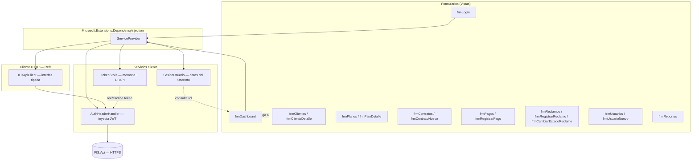
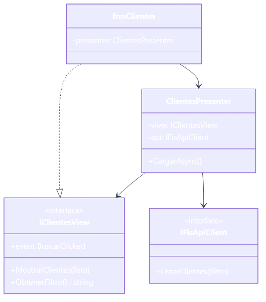
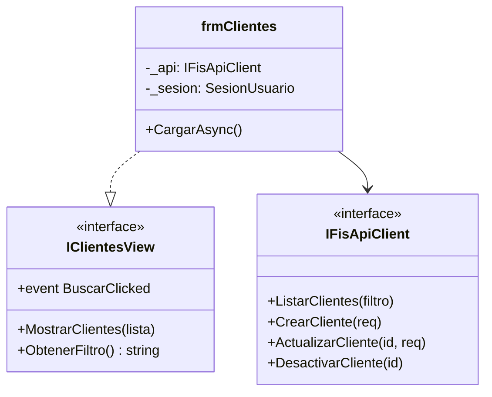
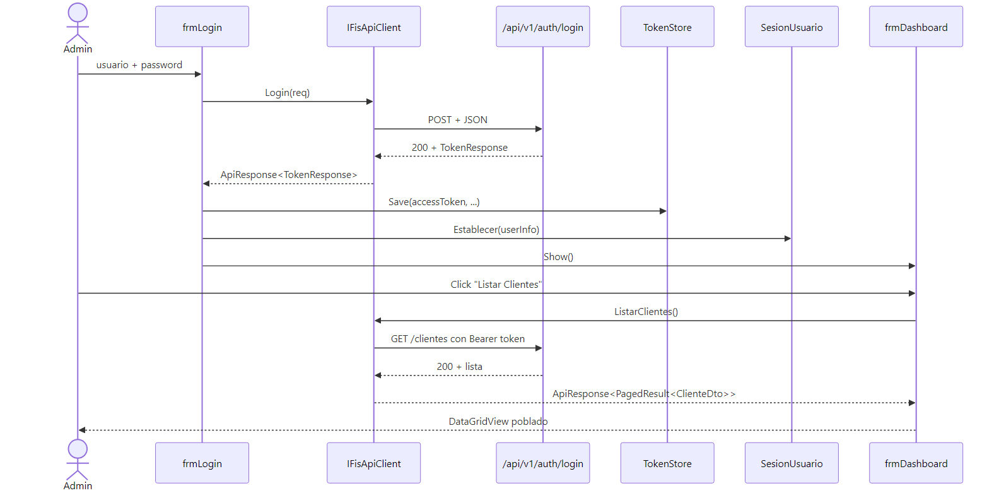
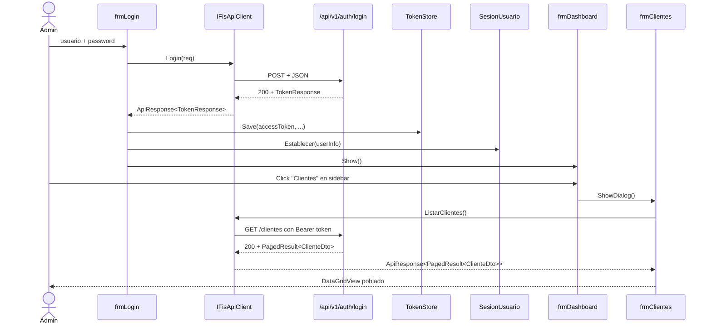

# 04 — Aplicación Desktop (WinForms .NET 9)

Cliente administrativo completo en WinForms que consume la API REST mediante Refit. Cubre los 17 RF implementados con 12 formularios y un dashboard con menú lateral adaptado al rol del usuario autenticado.

---

## 4.1 Arquitectura del Cliente Desktop


<details>
<summary>Ver fuente Mermaid</summary>



</details>

---

## 4.2 Formularios Implementados

| Formulario | RF / HU | Roles | Funcionalidad |
|---|---|---|---|
| `frmLogin` | RF01 / HU01 | Todos | Login con JWT; error con código HTTP |
| `frmDashboard` | RF01 | Todos | Menú lateral con 7 módulos adaptado al rol |
| `frmClientes` | RF02 | Admin, Cajero | Lista paginada con búsqueda, botones CRUD |
| `frmClienteDetalle` | RF02 | Admin | Alta y edición de cliente (Natural / Jurídico) |
| `frmPlanes` | RF03, RF04 | Admin | Lista de planes con filtro de activos |
| `frmPlanDetalle` | RF03, RF04 | Admin | Alta y edición de plan (velocidades, precio) |
| `frmContratos` | RF05 | Admin, Cajero | Lista con acciones Suspender / Reactivar |
| `frmContratoNuevo` | RF05 | Admin | Asignar cliente + plan + fechas + método pago |
| `frmPagos` | RF06, RF07 | Admin, Cajero | Lista con botones Registrar y Anular |
| `frmRegistrarPago` | RF06 | Admin, Cajero | Registrar pago por contrato con método |
| `frmReclamos` | RF09-RF12 | Admin, Técnico | Lista con filtro de estado; asignar técnico |
| `frmRegistrarReclamo` | RF09, RF10 | Admin, Técnico | Alta de reclamo con clasificación |
| `frmCambiarEstadoReclamo` | RF12 | Admin, Técnico | Actualizar estado + observación/solución |
| `frmUsuarios` | RF16 | Admin | Lista de todos los usuarios con rol |
| `frmUsuarioNuevo` | RF16 | Admin | Crear usuario con asignación de rol |
| `frmReportes` | RF14, RF15 | Admin | Tres pestañas: Mora / Ventas / Técnicos |

---

## 4.3 Dashboard con Menú Lateral

El `frmDashboard` presenta un sidebar con todos los módulos. Los botones marcados como **solo admin** se deshabilitan automáticamente si el usuario no tiene el rol `Administrador`:

```csharp
foreach (var (btn, _) in _menuItems)
{
    var soloAdmin = (bool)(btn.Tag ?? false);
    if (soloAdmin)
        btn.Enabled = _sesion.EsAdministrador;
}
```

Módulos del sidebar:

| Botón | Solo admin | Abre |
|---|---|---|
| Clientes | No | `frmClientes` |
| Planes de Servicio | **Sí** | `frmPlanes` |
| Contratos | **Sí** | `frmContratos` |
| Pagos | No | `frmPagos` |
| Soporte / Reclamos | No | `frmReclamos` |
| Usuarios y Roles | **Sí** | `frmUsuarios` |
| Reportes | **Sí** | `frmReportes` |

---

## 4.4 Patrón MVP (Model-View-Presenter)



<details>
<summary>Ver fuente Mermaid</summary>



</details>

> Los formularios de detalle (`frmClienteDetalle`, `frmRegistrarPago`, etc.) encapsulan directamente la lógica de guardado para mantener simplicidad en la PoC académica.

---

## 4.5 Interfaz Refit — `IFisApiClient`

La interfaz `IFisApiClient` mapea **1:1** todos los endpoints del backend:

```csharp
// Autenticación
[Post("/api/v1/auth/login")]
Task<TokenApiResponse> Login([Body] LoginRequest req);

// CRUD de clientes
[Get("/api/v1/clientes")]
Task<ClientesPagedResponse> ListarClientes([Query] string? filtro, ...);
[Post("/api/v1/clientes")]
Task<ClienteApiResponse> CrearCliente([Body] CrearClienteRequest request);
[Put("/api/v1/clientes/{id}")]
Task<ClienteApiResponse> ActualizarCliente(int id, [Body] CrearClienteRequest request);

// Reclamos
[Post("/api/v1/reclamos")]
Task<ReclamoApiResponse> RegistrarReclamo([Body] RegistrarReclamoRequest request);
[Patch("/api/v1/reclamos/{id}/tecnico")]
Task<ReclamoApiResponse> AsignarTecnico(int id, [Body] AsignarTecnicoRequest request);

// Reportes
[Get("/api/v1/reportes/mora")]
Task<ReporteMoraResponse> ReporteMora();
[Get("/api/v1/reportes/ventas")]
Task<ReporteVentasResponse> ReporteVentas([Query] int anio = 0);
```

> Se usan alias `using` para desambiguar `FIS.Contracts.Common.ApiResponse<T>` de `Refit.ApiResponse<T>`.

---

## 4.6 Inyección del JWT — `AuthHeaderHandler`

```csharp
public class AuthHeaderHandler : DelegatingHandler
{
    private readonly TokenStore _tokens;
    public AuthHeaderHandler(TokenStore tokens) => _tokens = tokens;

    protected override Task<HttpResponseMessage> SendAsync(
        HttpRequestMessage request, CancellationToken ct)
    {
        if (!string.IsNullOrEmpty(_tokens.AccessToken))
            request.Headers.Authorization =
                new AuthenticationHeaderValue("Bearer", _tokens.AccessToken);
        return base.SendAsync(request, ct);
    }
}
```

---

## 4.7 RBAC en la UI

`SesionUsuario` expone propiedades `EsAdministrador`, `EsCajero`, `EsTecnico`. Los formularios las usan para habilitar/deshabilitar controles:

```csharp
// frmClientes — solo admin puede crear/editar/desactivar
_btnNuevo.Enabled = _sesion.EsAdministrador;
_btnEditar.Enabled = _sesion.EsAdministrador;
_btnDesactivar.Enabled = _sesion.EsAdministrador;

// frmPagos — solo admin puede anular
_btnAnular.Enabled = _sesion.EsAdministrador;

// frmReclamos — solo admin puede asignar técnico
_btnAsignar.Enabled = _sesion.EsAdministrador;
```

> **Doble validación**: la UI deshabilita visualmente el control, pero el endpoint en la API también requiere el rol con `[Authorize(Roles = "Administrador")]`. Ninguna de las dos capas es suficiente sola.

---

## 4.8 Almacenamiento Seguro de Tokens

`TokenStore` mantiene los tokens en memoria. Para persistir el refresh token entre sesiones:

```csharp
public static string Protect(string plain) =>
    Convert.ToBase64String(ProtectedData.Protect(
        Encoding.UTF8.GetBytes(plain), null,
        DataProtectionScope.CurrentUser));
```

> **DPAPI** cifra con la identidad del usuario Windows actual. Otro usuario en la misma máquina no puede descifrar el token.

---

## 4.9 Bootstrap de DI en `Program.cs`

```csharp
services.AddSingleton<TokenStore>();
services.AddSingleton<SesionUsuario>();
services.AddTransient<AuthHeaderHandler>();

services.AddRefitClient<IFisApiClient>()
    .ConfigureHttpClient(c => c.BaseAddress = new Uri(apiBaseUrl))
    .AddHttpMessageHandler<AuthHeaderHandler>();

services.AddTransient<frmLogin>();
services.AddTransient<frmDashboard>(provider =>
    new frmDashboard(
        provider.GetRequiredService<IFisApiClient>(),
        provider.GetRequiredService<TokenStore>(),
        provider.GetRequiredService<SesionUsuario>(),
        provider));  // IServiceProvider para instanciar módulos al navegar
```

---

## 4.10 Flujo Login → Dashboard → Módulo



<details>
<summary>Ver fuente Mermaid</summary>



</details>

---

## 4.11 Cómo Probar

```powershell
# Asume que la API está corriendo en https://localhost:7001
dotnet run --project src/FIS.Desktop

# Login con: admin / Admin123*
# Sidebar disponible:
#   Clientes         → frmClientes (CRUD completo)
#   Planes           → frmPlanes   (solo admin)
#   Contratos        → frmContratos
#   Pagos            → frmPagos    (anular solo admin)
#   Soporte/Reclamos → frmReclamos (asignar solo admin)
#   Usuarios y Roles → frmUsuarios (solo admin)
#   Reportes         → frmReportes (3 pestañas)
#
# Login con: cajero1 / Cajero123*
# → Solo verá Clientes, Pagos y Soporte habilitados.
# → Botones de admin aparecen deshabilitados.
#
# Login con: tecnico1 / Tecnico123*
# → Solo verá Soporte/Reclamos habilitado.
```

---

## 4.12 Distribución (Producción)

### MSIX (recomendado para Windows 10/11)
- Empaquetado moderno con auto-update.
- Firma digital con certificado corporativo.
- Distribución vía Microsoft Store / sitio web / SCCM.

### ClickOnce (alternativa rápida)
- Despliegue en URL HTTPS.
- Auto-actualización al iniciar la app.

### Publicación como ejecutable único

```xml
<RuntimeIdentifier>win-x64</RuntimeIdentifier>
<PublishSingleFile>true</PublishSingleFile>
<SelfContained>true</SelfContained>
```

---

## Referencias del PDF

| Sección PDF | Tema |
|---|---|
| RF01-RF18 | Funcionalidades implementadas en el desktop |
| 3.5.6 — Capa de Presentación | WinForms como cliente |
| HU01-HU22 | Pantallas y casos de uso por rol |
| 3.3 — Mockups | Pantallas mostradas en el PDF |
