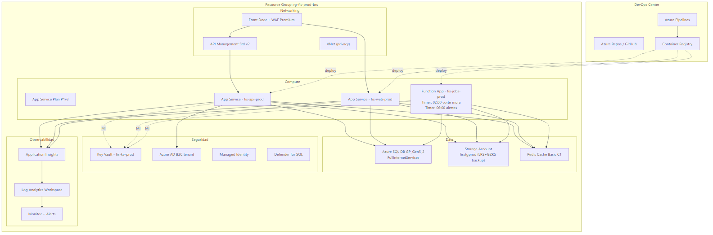
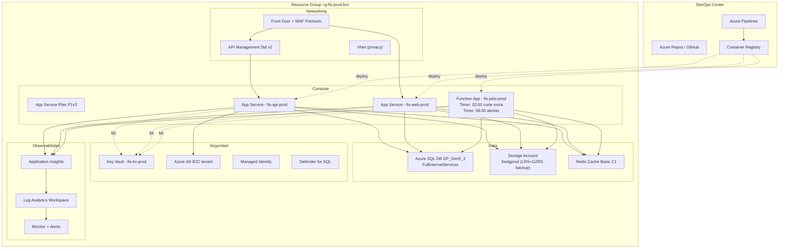
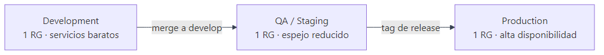
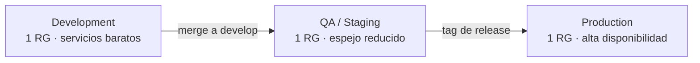
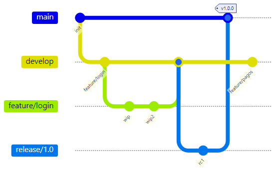
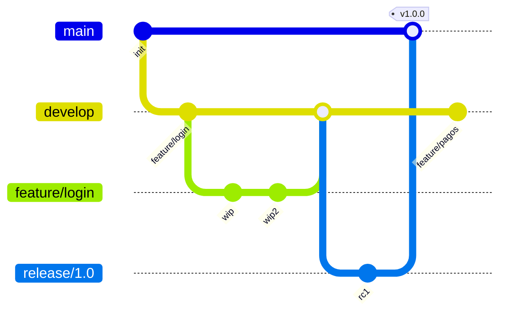
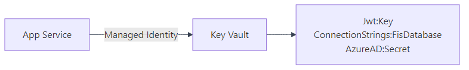
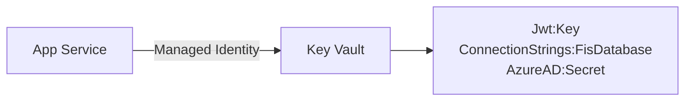

# 05 — Cloud Azure

Estrategia de despliegue en Microsoft Azure: servicios elegidos, ambientes y pipeline CI/CD.

---

## 5.1 Topología Azure



<details>
<summary>Ver fuente Mermaid</summary>



</details>

---

## 5.2 Catálogo de Servicios

| Servicio | SKU recomendado | Justificación |
|---|---|---|
| **Azure SQL Database** | GP_Gen5_2 (Prod) / Basic 5 DTU (Dev) | Base relacional con HA y backup automático. |
| **App Service Plan** | P1v3 Linux (Prod) / B1 (Dev) | Hosting de API + web; auto-scale ya disponible. |
| **App Service (API)** | Plan P1v3, .NET 9 | Backend RESTful. |
| **App Service (Web)** | Plan P1v3, .NET 9 | Portal cliente (HU08). |
| **Azure Functions** | Consumption Plan | Jobs de mora, alertas y backups. Timer Triggers. |
| **API Management** | Standard v2 | Versionado, throttling, OpenAPI público, suscripciones. |
| **Front Door + WAF** | Premium | TLS 1.3, CDN para web pública, WAF L7. |
| **Storage Account** | Standard LRS | Audios HU17 + PDFs de recibos en `Hot` tier. |
| **Cache for Redis** | Basic C1 | Catálogos (planes, ciudades) + sesión opcional. |
| **Key Vault** | Standard | Conn strings, JWT keys, certificados TLS. |
| **AAD B2C** | Tenant compartido | Identidad de **clientes finales** (HU08). Empleados usan AAD corporativo. |
| **Application Insights** | Pay-as-you-go | APM + traces + logs estructurados. |
| **Log Analytics** | Pay-as-you-go (30d retain) | Centraliza logs de todos los recursos. |
| **Defender for SQL** | Add-on | Detección de anomalías + assessment continuo. |
| **Container Registry** | Basic | Imágenes Docker (si se contenedoriza). |

---

## 5.3 Ambientes



<details>
<summary>Ver fuente Mermaid</summary>



</details>

| Recurso | Dev | QA | Prod |
|---|---|---|---|
| App Service | B1 | S1 | P1v3 (3 instancias) |
| Azure SQL | Basic 5 DTU | S1 (20 DTU) | GP_Gen5_2 |
| Front Door | – | Std | Premium |
| Cache | – | Basic C0 | Basic C1 |
| Backups | semanal manual | diario | continuo + LTR 7 años |
| Slots | – | 1 staging | 1 staging + canary |

### Convención de nombres
`fis-{servicio}-{env}-{region}` → `fis-api-prod-brs`, `fis-sql-qa-brs`...

---

## 5.4 CI/CD Pipeline

### `azure-pipelines.yml` (esqueleto)

```yaml
trigger:
  branches:
    include: [ main, develop ]

stages:
- stage: Build
  jobs:
  - job: BuildAndTest
    pool: { vmImage: 'windows-latest' }
    steps:
    - task: UseDotNet@2
      inputs: { version: '9.0.x' }
    - script: dotnet restore
    - script: dotnet build --configuration Release --no-restore
    - script: dotnet test --no-build --logger trx --collect:"XPlat Code Coverage"
    - task: PublishTestResults@2
    - task: PublishCodeCoverageResults@2
    - task: DotNetCoreCLI@2
      inputs:
        command: publish
        projects: src/FIS.Api/FIS.Api.csproj
        arguments: --output $(Build.ArtifactStagingDirectory) --configuration Release
    - publish: $(Build.ArtifactStagingDirectory)
      artifact: api

- stage: DeployDev
  dependsOn: Build
  condition: eq(variables['Build.SourceBranch'], 'refs/heads/develop')
  jobs:
  - deployment: Deploy
    environment: dev
    strategy:
      runOnce:
        deploy:
          steps:
          - download: current
            artifact: api
          - task: AzureWebApp@1
            inputs:
              azureSubscription: 'fis-azure-conn'
              appName: 'fis-api-dev-brs'
              package: '$(Pipeline.Workspace)/api/**/*.zip'

- stage: DeployProd
  dependsOn: Build
  condition: startsWith(variables['Build.SourceBranch'], 'refs/tags/v')
  jobs:
  - deployment: Deploy
    environment: prod
    strategy:
      runOnce:
        deploy:
          steps:
          - task: AzureWebApp@1
            inputs:
              azureSubscription: 'fis-azure-conn'
              appName: 'fis-api-prod-brs'
              package: '$(Pipeline.Workspace)/api/**/*.zip'
              deploymentMethod: 'auto'
```

### Flujo Git recomendado



<details>
<summary>Ver fuente Mermaid</summary>



</details>

- `main` → Producción (protegida; sólo via PR + tag).
- `develop` → QA (auto-deploy en cada merge).
- `feature/*` → Pull Request hacia develop.
- `release/*` → Estabilización antes de producción.

---

## 5.5 Secretos y Configuración

### Key Vault como única fuente de verdad



<details>
<summary>Ver fuente Mermaid</summary>



</details>

- App Service consulta `@Microsoft.KeyVault(SecretUri=https://fis-kv-prod.vault.azure.net/...)`.
- **Nunca** se versionan secretos en `appsettings.*.json` (placeholder `CAMBIAR_EN_PRODUCCION_...`).

### Rotación
- JWT signing key: rotación cada 90 días.
- DB connection: rotación al rotar la contraseña SQL admin.

---

## 5.6 Estrategia de Backup y DR

| Activo | Frecuencia | Retención | Geo? |
|---|---|---|---|
| Azure SQL DB | Continua (Point-in-Time) | 7 días + LTR semanal × 7 años | GZRS |
| Storage Account (audios) | Soft delete + versioning | 30 días + GRS | Sí |
| Key Vault | Soft delete | 90 días | – |
| App Service config | ARM template versionado | – | – |

> RNF13 (PDF): backup diario automático con retención de 30 días → cumplido y excedido vía LTR.

---

## 5.7 Costo Estimado Mensual (Brasil South, valores 2026)

| Servicio | SKU | Costo |
|---|---|---|
| App Service Plan P1v3 (3 inst) | – | ~$160 |
| Azure SQL GP_Gen5_2 | – | ~$370 |
| Front Door Premium | – | ~$165 + tráfico |
| API Management Standard v2 | – | ~$700 |
| Storage 100 GB | – | ~$5 |
| Redis Basic C1 | – | ~$55 |
| Application Insights (50 GB) | – | ~$115 |
| Functions Consumption | – | ~$10 (jobs ligeros) |
| **Total estimado** | | **~$1,580 / mes** |

> Para academic POC: usar SKUs Free/Basic baja el costo a <$50/mes.

---

## Referencias del PDF

| Sección PDF | Adaptación a Azure |
|---|---|
| 3.12 — Modelo de Despliegue | Docker Compose → Azure App Service + Functions + SQL |
| RNF03 — Disponibilidad 99% | App Service SLA 99.95%, SQL 99.99% |
| RNF13 — Backups | Backup automático nativo + LTR |
| RNF07 — Cifrado | TLS 1.3 (Front Door + APIM), TDE en SQL |
| RNF09 — Escalabilidad | Auto-scale por CPU + colas |
