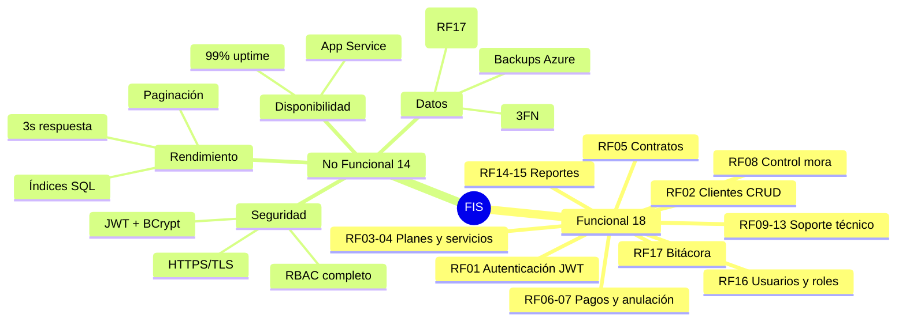
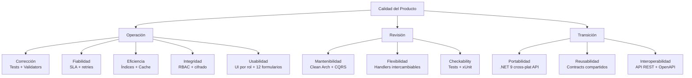

# 06 — Requerimientos y Matriz de Cumplimiento

Trazabilidad de los 18 RF y 14 RNF del PDF a su implementación arquitectónica. Actualizado con el estado real del repositorio.

---

## 6.1 Resumen Visual


<details>
<summary>Ver fuente Mermaid</summary>



</details>

---

## 6.2 Matriz de Requerimientos Funcionales

| Cód. | Nombre | Rol | API | Desktop | Estado |
|---|---|---|---|---|---|
| RF01 | Autenticación | Admin, Técnico | `POST /auth/login` | `frmLogin` | ✓ **JWT** — biometría roadmap |
| RF02 | Gestión de clientes | Admin | `GET/POST/PUT/DELETE /clientes` | `frmClientes` + `frmClienteDetalle` | ✓ **Completo** |
| RF03 | Gestión de servicios | Admin | `GET/POST/PUT/DELETE /planes` | `frmPlanes` + `frmPlanDetalle` | ✓ **Completo** |
| RF04 | Gestión de planes internet | Admin | `GET/POST/PUT/DELETE /planes` | `frmPlanes` | ✓ **Completo** (velocidades Mbps) |
| RF05 | Registro de contratos | Admin | `GET/POST /contratos`, `PATCH .../estado` | `frmContratos` + `frmContratoNuevo` | ✓ **Completo** |
| RF06 | Registro de pagos | Admin, Sistema | `GET/POST /pagos` | `frmPagos` + `frmRegistrarPago` | ✓ **Completo** |
| RF07 | Anulación de pagos | Admin | `POST /pagos/anular` | `frmPagos` | ✓ **Completo** |
| RF08 | Control de mora (día 12) | Sistema | `GET /reportes/mora` | `frmReportes` tab Mora | ✓ **Completo** |
| RF09 | Registro de reclamos | Técnico | `POST /reclamos` | `frmReclamos` + `frmRegistrarReclamo` | ✓ **Completo** |
| RF10 | Clasificación de reclamos | Técnico | `POST /reclamos` (campo `clasificacion`) | `frmRegistrarReclamo` (combo Leve/Medio/Complejo) | ✓ **Completo** |
| RF11 | Asignación de técnicos | Admin | `PATCH /reclamos/{id}/tecnico` | `frmReclamos` | ✓ **Completo** (límite 5 activos) |
| RF12 | Estado de soporte | Técnico | `PATCH /reclamos/{id}/estado` | `frmCambiarEstadoReclamo` | ✓ **Completo** (4 estados) |
| RF13 | Grabación de llamadas | Sistema | Modelo (`RutaAudio`, `HashSha256`) | — | Modelo listo — Azure Blob en roadmap |
| RF14 | Evaluación de técnicos | Admin | `GET /reportes/tecnicos` | `frmReportes` tab Técnicos | ✓ **Completo** |
| RF15 | Generación de reportes | Admin | `GET /reportes/mora`, `/ventas`, `/tecnicos` | `frmReportes` (3 pestañas) | ✓ **Completo** |
| RF16 | Gestión de usuarios y roles | Admin | `GET/POST /usuarios` | `frmUsuarios` + `frmUsuarioNuevo` | ✓ **Completo** |
| RF17 | Bitácora de operaciones | Sistema | `GET /reportes/bitacora` | — | ✓ **Completo** (entidad + migración) |
| RF18 | Plataforma web de pagos | Cliente | — | — | **Roadmap** Fase 2 |

### Leyenda de estados

- ✓ **Completo**: endpoint + handler + repositorio + formulario WinForms.
- ✓ **JWT**: autenticación estándar sin biometría.
- Modelo listo: entidad y estructura DB definidos; integración pendiente.
- **Roadmap**: planificado para Fase 2 (post-MVP).

---

## 6.3 Detalle de Implementación por RF Clave

### RF08 — Control de Mora

La lógica en `ReporteService`:

```csharp
if (hoy.Day <= 12) return new List<ReporteMoraDto>();

return await _ctx.Contratos
    .Where(c => c.Estado == EstadoContrato.Activo)
    .Select(c => new ReporteMoraDto {
        MontoMora = c.Plan.PrecioMensual * 0.10m,
        DiasAtraso = hoy.Day - 12
    })
    .ToListAsync(ct);
```

### RF11 — Límite de Reclamos por Técnico

La entidad `Reclamo` encapsula la regla de negocio:

```csharp
private const int MaxReclamosPorTecnico = 5;

public void AsignarTecnico(int idTecnico, int reclamosActivosDelTecnico)
{
    if (reclamosActivosDelTecnico >= MaxReclamosPorTecnico)
        throw new BusinessException(
            $"El técnico ha alcanzado el límite de {MaxReclamosPorTecnico} reclamos activos.");
    IdTecnico = idTecnico;
    if (Estado == EstadoReclamo.Recepcionado)
        Estado = EstadoReclamo.EnProceso;
}
```

### RF17 — Bitácora

La tabla `BITACORA` se crea con la migración `AddBitacora`. Los triggers SQL la alimentan automáticamente. Desde la API es de solo lectura:

```csharp
GET /api/v1/reportes/bitacora?page=1&pageSize=50&tabla=PAGO
```

---

## 6.4 Matriz de Requerimientos No Funcionales

| Cód. | RNF | Estrategia de implementación | Estado |
|---|---|---|---|
| RNF01 | Seguridad de acceso — biometría | JWT obligatorio + middleware; biométrico planificado con Azure Face API | ✓ JWT implementado |
| RNF02 | Control de acceso por roles | `[Authorize(Roles=...)]` en todos los endpoints + UI filtrada por `SesionUsuario` | ✓ Completo |
| RNF03 | Auditoría / bitácora | Triggers SQL + entidad `BitacoraOperacion` + endpoint `GET /reportes/bitacora` | ✓ Completo |
| RNF04 | Rendimiento < 3s | Índices `IX_*` + paginación + `ReporteService` con queries optimizadas | ✓ Diseñado |
| RNF05 | Disponibilidad 99% | App Service P1v3 multi-instance, SLA 99.95% Azure | ✓ Diseñado |
| RNF06 | Almacenamiento de audios | Modelo `Reclamo.RutaAudio` + `HashSha256`; Azure Blob en roadmap | Modelo listo |
| RNF07 | Seguridad de datos | HTTPS/TLS + BCrypt + TDE en Azure SQL | ✓ Implementado |
| RNF08 | Usabilidad | UI adaptada por rol, formularios intuitivos, mensajes de error claros | ✓ Implementado |
| RNF09 | Compatibilidad | API REST + WinForms `net9.0-windows` | ✓ Implementado |
| RNF10 | Multiplataforma | API desplegable en Linux/Azure; Desktop Windows | ✓ Diseñado |
| RNF11 | Escalabilidad | Auto-scale + paginación en todos los listados | ✓ Diseñado |
| RNF12 | Respaldo de información | Azure SQL backup automático + LTR | ✓ Diseñado |
| RNF13 | Integridad de datos | FKs + triggers + transacciones + `IUnitOfWork` | ✓ Implementado |
| RNF14 | Exportación de reportes | EPPlus (Excel) + QuestPDF en roadmap; actualmente JSON vía API | Roadmap |

---

## 6.5 Modelo de Calidad (McCall)


<details>
<summary>Ver fuente Mermaid</summary>



</details>

| Pilar | Cobertura actual |
|---|---|
| Corrección | 9 tests xUnit, FluentValidation en comandos, middleware de excepciones |
| Fiabilidad | SLA Azure 99.95%, transacciones EF, `IUnitOfWork` |
| Eficiencia | Índices `IX_*`, paginación en todos los listados, `IReporteService` |
| Integridad | JWT + RBAC + BCrypt + HTTPS + TDE + bitácora RF17 |
| Usabilidad | 12 formularios WinForms, UI por rol, mensajes descriptivos |
| Mantenibilidad | 4 capas, 25 handlers, naming en español |

---

## 6.6 Historias de Usuario — Estado Actualizado

| HU | Título | Prioridad | SP | Estado Actual |
|---|---|---|---|---|
| HU01 | Login con biometría | M (Must) | 13 | ✓ Login JWT — biometría roadmap |
| HU02 | Gestión de roles | M | 5 | ✓ RBAC + `UsuariosController` |
| HU03 | Gestión de clientes | M | 5 | ✓ CRUD completo |
| HU04 | Gestión de planes | M | 5 | ✓ `PlanesController` completo |
| HU05 | Registro de contratos | M | 8 | ✓ `ContratosController` |
| HU06 | Suspensión de contratos | M | 3 | ✓ `PATCH .../estado` |
| HU07 | Registrar pago | M | 8 | ✓ `PagosController` |
| HU08 | Pagos en línea (web) | S (Should) | 13 | **Roadmap** Fase 2 |
| HU09 | Anulación de pagos | M | 5 | ✓ `POST /pagos/anular` |
| HU10 | Control de mora | M | 5 | ✓ `GET /reportes/mora` |
| HU14 | Recepción de reclamos | M | 8 | ✓ `ReclamosController` |
| HU15 | Asignación de técnicos | M | 5 | ✓ `PATCH .../tecnico` |
| HU16 | Cierre de reclamos | M | 5 | ✓ `PATCH .../estado` + `RegistrarSolucion` |
| HU17 | Grabación de llamadas | C (Could) | 8 | Modelo + campo; storage roadmap |
| HU20 | Reportes operativos | S | 5 | ✓ Mora / Ventas / Técnicos |
| HU21 | Reporte técnicos ineficientes | S | 3 | ✓ `GET /reportes/tecnicos` |
| HU22 | Auditoría / bitácora | S | 5 | ✓ Tabla + migración + endpoint |
