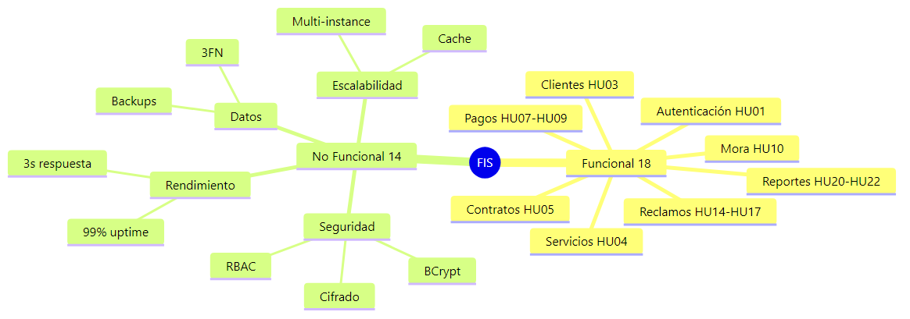
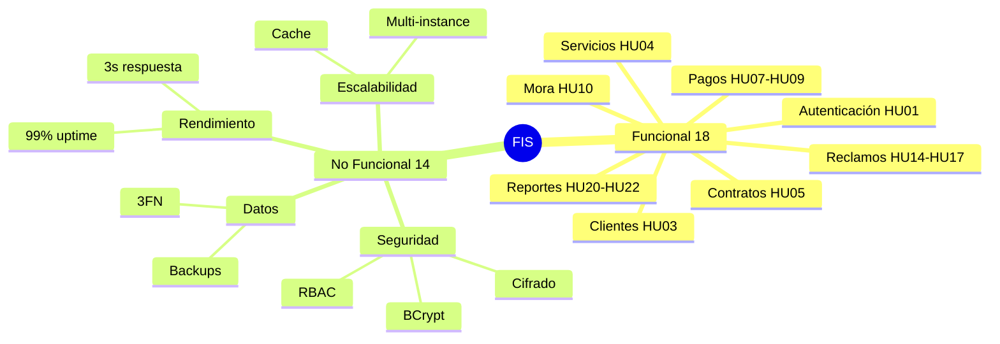
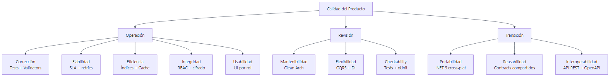
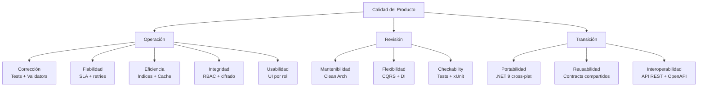

# 06 — Requerimientos y Matriz de Cumplimiento

Trazabilidad de los 18 RF y 14 RNF del PDF a su implementación arquitectónica.

---

## 6.1 Resumen Visual

Ver fuente Mermaid

---

## 6.2 Matriz de Requerimientos Funcionales

| Cód. | Descripción | HU | Implementación | Estado |
|---|---|---|---|---|
| RF01 | Autenticación con login y biometría | HU01 | `AuthController` + JWT; biométrico planificado | **PoC** |
| RF02 | Gestión de roles y permisos | HU02 | RBAC con `[Authorize(Roles = ...)]` | **PoC** |
| RF03 | Registro / actualización de clientes | HU03 | `ClientesController` + `sp_cliente_*` | Diseñado |
| RF04 | Gestión de servicios y planes | HU04 | `PlanesController` (pendiente) | Diseñado |
| RF05 | Registro de contratos | HU05 | `Contrato` entity + repo | Diseñado |
| RF06 | Renovación / cancelación de contratos | HU06 | `Contrato.Cancelar()`, `Suspender()` | Diseñado |
| RF07 | Registro de pagos | HU07 | `RegistrarPagoCommand` + `sp_pago_insert` | Diseñado |
| RF08 | Pagos en línea | HU08 | App Web + AAD B2C + pasarela | Roadmap |
| RF09 | Anulación de pagos | HU09 | `AnularPagoCommand` (Admin only) | Diseñado |
| RF10 | Control de mora | HU10 | `Mora` entity + `Job sp_actualizar_mora` | Diseñado |
| RF11 | Cálculo automático recargo 10% | HU10 | `CalculadoraMoraService` (con tests) | **Implementado** |
| RF12 | Suspensión por morosidad | HU11 | `Mora.CortarServicio()` + Job diario | Diseñado |
| RF13 | Recepción de reclamos | HU14 | `ReclamosController` + canales | Diseñado |
| RF14 | Asignación de técnicos | HU15 | `sp_reclamo_asignar_tecnico` (límite 5) | Diseñado |
| RF15 | Cierre y calificación de reclamos | HU16 | `Reclamo.RegistrarSolucion()` + `Calificar()` | **Implementado** (entidad) |
| RF16 | Grabación y resguardo de llamadas | HU17 | Blob Storage + hash SHA256 | Diseñado |
| RF17 | Reportes operativos | HU20-HU21 | `sp_reporte_mora`, vistas SQL | Diseñado |
| RF18 | Auditoría / Bitácora | HU22 | Triggers SQL + `BitacoraService` | Diseñado |

### Leyenda de estados
- **Implementado**: código y tests ya en repo.
- **PoC**: vertical funcional para demostrar el patrón.
- **Diseñado**: arquitectura definida, falta el código.
- **Roadmap**: Fase 2 (post-MVP).

---

## 6.3 Matriz de Requerimientos No Funcionales

| Cód. | RNF | Estrategia | Sección Docs |
|---|---|---|---|
| RNF01 | Acceso solo a usuarios registrados | JWT obligatorio + middleware | [02-backend §2.4](../02-backend/README.md#24-autenticación-y-autorización-rbac) |
| RNF02 | Permisos según rol (RBAC) | `[Authorize(Roles=...)]` + UI filtrada | [02-backend §2.4](../02-backend/README.md#24-autenticación-y-autorización-rbac) |
| RNF03 | Disponibilidad 99% | App Service P1v3 multi-instance, SLA 99.95% | [05-cloud §5.3](../05-cloud-azure/README.md#53-ambientes) |
| RNF04 | Tiempo de respuesta < 3s | Índices + cache Redis + paginación | [03-bd §3.4](../03-base-datos/README.md#34-estrategia-de-indexado) |
| RNF05 | Soporte concurrencia 50 usuarios | App Service auto-scale + connection pooling | [05-cloud §5.1](../05-cloud-azure/README.md) |
| RNF06 | Bloqueo tras 5 intentos fallidos | `Usuario.RegistrarIntentoFallido()` + trigger | [02-backend §2.4](../02-backend/README.md#bloqueo-por-intentos-fallidos-rnf06) |
| RNF07 | Cifrado de datos | HTTPS/TLS 1.3 + BCrypt + TDE en SQL | [02-backend §2.4](../02-backend/README.md) |
| RNF08 | Integridad referencial | FKs + triggers + transacciones | [03-bd §3.6](../03-base-datos/README.md#36-triggers) |
| RNF09 | Escalabilidad | Auto-scale + caching + queue para jobs | [07-mejoras §3.4](../07-mejoras/README.md#34-caching) |
| RNF10 | Mantenibilidad | Clean Architecture + tests + docs | [01-arquitectura §1.2](../01-arquitectura/README.md#12-arquitectura-por-capas-clean-architecture) |
| RNF11 | Eliminación lógica (no física) | `Activo = false` + filtros en queries | [03-bd §3.1](../03-base-datos/README.md) |
| RNF12 | Almacenamiento seguro de audios | Blob privado + SAS firmado + SHA256 | [05-cloud §5.1](../05-cloud-azure/README.md) |
| RNF13 | Backup diario | Azure SQL backup automático + LTR | [05-cloud §5.6](../05-cloud-azure/README.md#56-estrategia-de-backup-y-dr) |
| RNF14 | Exportación a Excel/PDF | EPPlus + QuestPDF en endpoints `/reportes/...` | [02-backend §2.3](../02-backend/README.md#23-endpoints-rest-poc-actual--diseño-completo) |

---

## 6.4 Modelo de Calidad (McCall)

Ver fuente Mermaid

| Pilar | Cobertura |
|---|---|
| Corrección | Tests xUnit (9 hechos), FluentValidation por comando |
| Fiabilidad | SLA Azure 99.95%, transacciones EF, retry policies |
| Eficiencia | Índices `IX_*`, cache Redis, paginación |
| Integridad | JWT + RBAC + BCrypt + HTTPS + TDE |
| Mantenibilidad | 4 capas, dependencias unidireccionales, naming en español |

---

## 6.5 Historias de Usuario y Priorización

Resumen de las 22 HU del PDF con criterios MoSCoW y Story Points (capítulo 3.4 del PDF).

| HU | Título | Prioridad | SP | Estado |
|---|---|---|---|---|
| HU01 | Login con biometría | M (Must) | 13 | PoC sin biometría |
| HU03 | Gestión de clientes | M | 5 | PoC GET listado |
| HU07 | Registrar pago | M | 8 | Diseñado |
| HU08 | Pagos en línea | S (Should) | 13 | Roadmap |
| HU17 | Grabación de llamadas | C (Could) | 8 | Diseñado |
| HU20 | Reportes operativos | S | 5 | Diseñado |

> Lista completa: ver tablas HU01-HU22 del PDF, sección 3.4.
