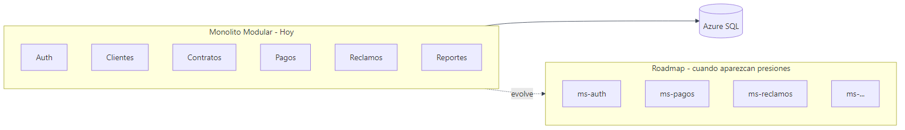
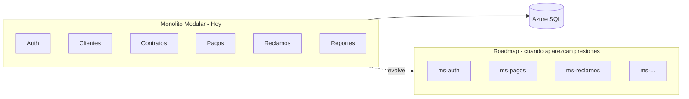
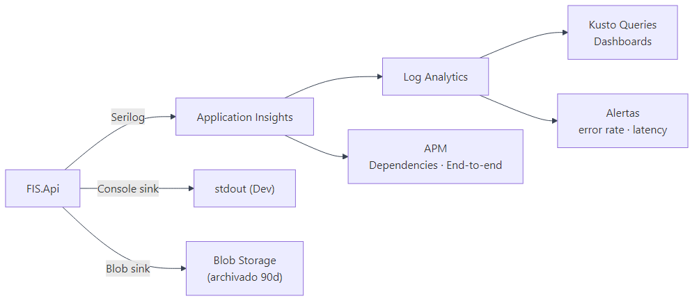
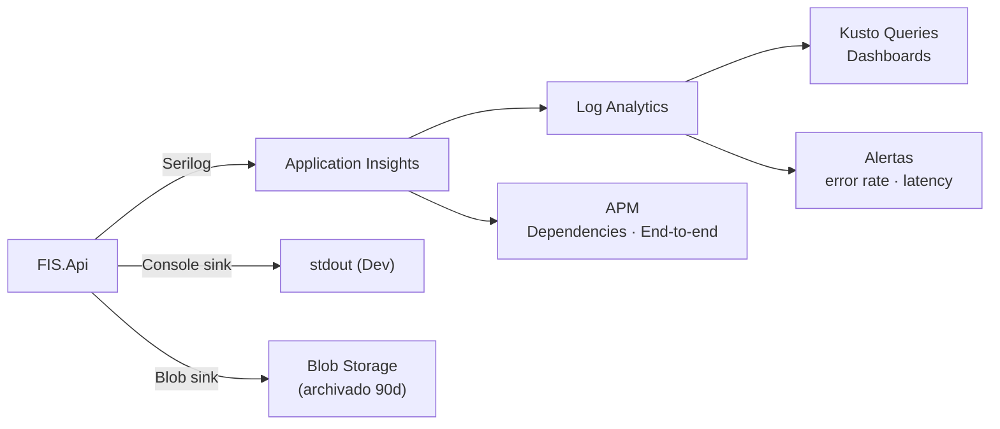
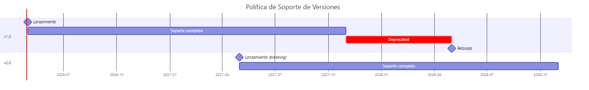
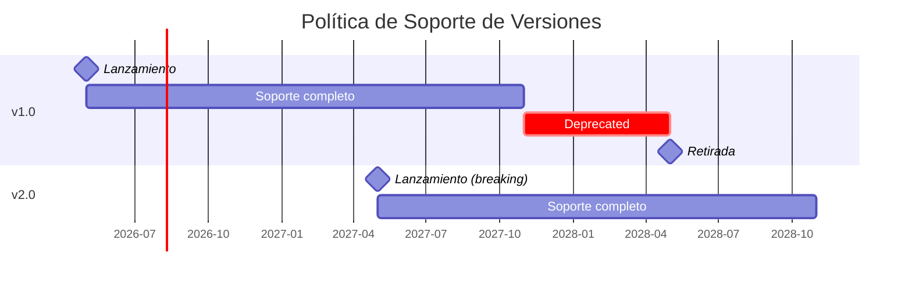
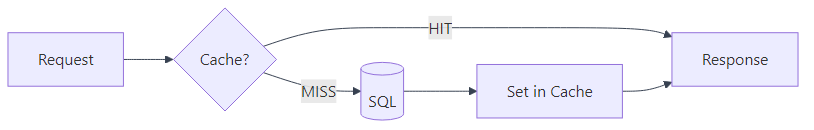
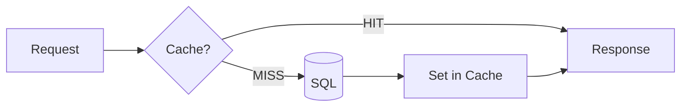
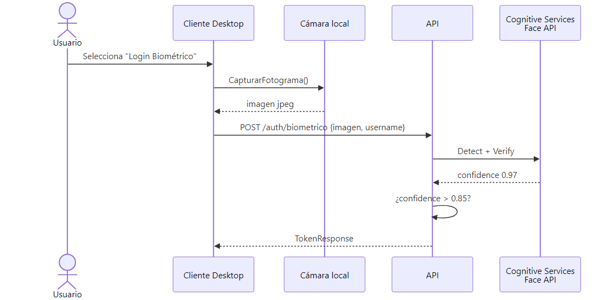
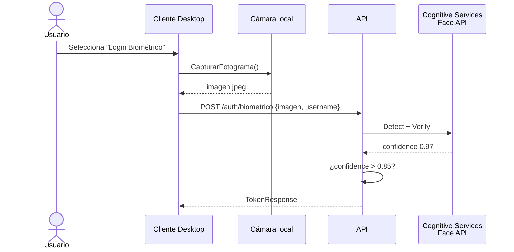

# 07 — Mejoras y Decisiones Arquitectónicas Avanzadas

Cuatro temas que el PDF menciona como deseables o que la práctica de la industria recomienda implementar de forma temprana.

---

## 7.1 Monolito vs. Microservicios

### Decisión: **Monolito modular** (Phase 1)



<details>
<summary>Ver fuente Mermaid</summary>



</details>

### Justificación
- **Equipo pequeño** (3 estudiantes / 1-3 desarrolladores): la complejidad operativa de microservicios excede el beneficio.
- **Dominio acoplado**: Pagos depende de Contratos, Reclamos depende de Cliente. Separarlos prematuramente genera saga distribuida innecesaria.
- **Trade-off**: si en el futuro `Reclamos` o `Pagos` necesitan escalar de forma independiente, la frontera ya está marcada por las `feature folders` de la capa Application.

### Cuándo migrar a microservicios
- Equipos > 6 personas independientes.
- Necesidad de tecnologías heterogéneas (Python ML, Node.js streaming).
- Componente con SLA o ciclo de release muy distinto al resto.
- Volumen de tráfico requiere escalado independiente.

> Patrón **Strangler Fig**: extraer un módulo a la vez detrás del API Gateway sin reescribir el resto.

---

## 7.2 Logging y Monitoreo

### Stack adoptado



<details>
<summary>Ver fuente Mermaid</summary>



</details>

### Categorías de logs

| Nivel | Contenido | Sink |
|---|---|---|
| Trace | EF Core SQL, HTTP detalle | sólo Dev |
| Debug | Branching de lógica | Dev + QA |
| Information | Inicio/fin requests, eventos de negocio | todos |
| Warning | Reglas de negocio violadas, retries | todos + alerta si > 50/min |
| Error | Excepciones no controladas | todos + alerta inmediata |

### Métricas clave (RNF04, RNF05)
- **Latencia P95** por endpoint: alerta si > 3s.
- **Tasa de errores 5xx**: alerta si > 1%.
- **Conexiones SQL activas**: alerta si > 80% del pool.
- **Login fallidos**: alerta si > 100/hora (posible ataque).

### Configuración

```csharp
builder.Host.UseSerilog((ctx, cfg) => cfg
    .ReadFrom.Configuration(ctx.Configuration)
    .Enrich.FromLogContext()
    .Enrich.WithProperty("Application", "FIS.Api")
    .Enrich.WithProperty("Environment", ctx.HostingEnvironment.EnvironmentName)
    .WriteTo.Console()
    .WriteTo.ApplicationInsights(...)
    .WriteTo.AzureBlobStorage(connStr, "fis-logs/{yyyy}/{MM}/{dd}.log"));
```

### Bitácora de auditoría (RF18, HU22)
Distinta del logging técnico:

```csharp
public interface IBitacoraService
{
    Task RegistrarAsync(string accion, string tabla, int idRegistro,
                       int idUsuario, string? datosAntes = null, string? datosDespues = null);
}
```
Persistida en tabla `BITACORA` (creada por triggers o por el servicio de aplicación).

---

## 7.3 Versionado de API

### Esquema: **URL Segment** (`/api/v1/...`)

| Esquema | Pros | Contras | Decisión |
|---|---|---|---|
| URL segment | Visible, cacheable, simple | Requiere cambiar URL para v2 | **✓ Adoptado** |
| Header (`api-version: 1.0`) | URL estable | Menos visible, harder cache | – |
| Query string (`?api-version=1.0`) | Simple | Mezcla versionado con datos | – |

### Política de evolución



<details>
<summary>Ver fuente Mermaid</summary>



</details>

- **2 versiones simultáneas** mínimo.
- **6 meses de deprecation** notificado vía header `Sunset:` y email a consumidores.
- **Cambios non-breaking** (añadir campo, nuevo endpoint) → mantener v1.

### Implementación

```csharp
[ApiController]
[ApiVersion("1.0")]
[Route("api/v{version:apiVersion}/clientes")]
public class ClientesController : ControllerBase { ... }
```

Para v2 con breaking change:
```csharp
[ApiVersion("2.0")]
[Route("api/v{version:apiVersion}/clientes")]
public class ClientesV2Controller : ControllerBase { ... }
```

---

## 7.4 Caching

### Estrategia por tipo de dato



<details>
<summary>Ver fuente Mermaid</summary>



</details>

| Dato | Patrón | TTL | Cache |
|---|---|---|---|
| Catálogo de planes | Cache-aside | 1h | Redis |
| Catálogo de roles | Cache-aside | 24h | Redis |
| Lista de clientes (filtro) | – (paginación) | – | – |
| Pago individual | – (transaccional) | – | – |
| Reporte mora del día | Read-through | 30 min | Redis |
| Dashboard KPI | Stale-while-revalidate | 5 min | Memory + Redis |

### Implementación con `IDistributedCache`

```csharp
public class PlanesService
{
    private readonly IPlanRepository _repo;
    private readonly IDistributedCache _cache;

    public async Task<List<PlanServicio>> ObtenerActivosAsync()
    {
        var cached = await _cache.GetStringAsync("planes:activos");
        if (cached is not null)
            return JsonSerializer.Deserialize<List<PlanServicio>>(cached)!;

        var planes = await _repo.ObtenerActivosAsync();
        await _cache.SetStringAsync(
            "planes:activos",
            JsonSerializer.Serialize(planes),
            new DistributedCacheEntryOptions
            {
                AbsoluteExpirationRelativeToNow = TimeSpan.FromHours(1)
            });
        return planes;
    }
}
```

### Invalidación
- **Por escritura**: tras `UPDATE PlanServicio` → `cache.Remove("planes:activos")`.
- **Por TTL**: como red de seguridad, todo entry expira eventualmente.
- **Por evento**: el handler de `PlanActualizado` invalida la clave.

---

## 7.5 Autenticación Biométrica (HU01) — Roadmap



<details>
<summary>Ver fuente Mermaid</summary>



</details>

- Plantilla biométrica almacenada en tabla `USUARIO_BIOMETRIA` (NO la imagen).
- Cifrada at-rest con TDE + Always Encrypted en columnas sensibles.
- Fallback a username/password siempre disponible.
- Cumple LGPD (BR) / Ley 1581 (CO) — el usuario debe consentir explícitamente.

---

## 7.6 Resumen de Mejoras Recomendadas

| Mejora | Beneficio | Esfuerzo | Prioridad |
|---|---|---|---|
| Application Insights | Observabilidad real | 0.5 día | **Alta** |
| Cache Redis para catálogos | -90% lecturas SQL | 1 día | **Alta** |
| Versionado URL segment | Evolución API | ya implementado | – |
| Bitácora con triggers | Cumplir HU22 | 2 días | **Alta** |
| Health checks `/health` | Auto-scale + alertas | 0.5 día | Media |
| Rate limiting (APIM) | Anti-abuso | configuración | Media |
| OpenTelemetry traces | Distributed tracing | 1 día | Media |
| Biometría facial | UX premium | 5 días | Baja (S) |
| Microservicios | Solo si escala lo exige | semanas | Roadmap |

---

## Referencias

- *Microsoft Cloud Adoption Framework* — Naming and tagging conventions.
- *Clean Architecture* — Robert C. Martin.
- *Building Evolutionary Architectures* — Neal Ford.
- PDF Proyecto FINAL — Sección 4 (RNF) y Sección 5 (mockups).
