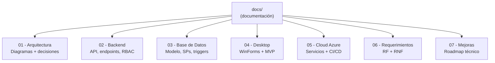

# Documentación — Full Internet Services

Este directorio contiene la documentación técnica completa de la solución, organizada por áreas. Cada subcarpeta tiene un `README.md` que explica el contenido y muestra los diagramas correspondientes.

---

## Mapa de la Documentación

Ver fuente Mermaid

---

## Índice

| # | Sección | Contenido |
|---|---|---|
| 01 | [Arquitectura](./01-arquitectura/README.md) | Diagrama general, arquitectura por capas, componentes, despliegue Azure |
| 02 | [Backend](./02-backend/README.md) | Estructura de proyectos, endpoints REST, RBAC, EF Core, CQRS con MediatR |
| 03 | [Base de Datos](./03-base-datos/README.md) | Modelo conceptual ER, modelo lógico, índices, procedimientos almacenados, triggers |
| 04 | [Desktop](./04-desktop/README.md) | Arquitectura WinForms, módulos del panel admin, consumo de la API, RBAC en UI |
| 05 | [Cloud Azure](./05-cloud-azure/README.md) | Servicios Azure, pipeline CI/CD, separación Dev/QA/Prod |
| 06 | [Requerimientos](./06-requerimientos/README.md) | 18 RF + 14 RNF + matriz de cumplimiento |
| 07 | [Mejoras](./07-mejoras/README.md) | Monolito vs microservicios, monitoreo, versionado, caching |

---

## Convenciones

- **Diagramas**: todos en formato Mermaid (renderizable en GitHub, GitLab, VSCode con el plugin *Markdown Preview Mermaid Support*, y la mayoría de editores Markdown modernos).
- **Idioma**: toda la documentación, código y comentarios están en **español**, alineados con el proyecto académico de Full Internet Services.
- **Trazabilidad**: cada decisión arquitectónica referencia el RF/RNF/HU correspondiente del documento *Proyecto FINAL.pdf*.

---

## Cómo Visualizar los Diagramas Mermaid

| Entorno | Instrucción |
|---|---|
| GitHub / GitLab | Renderizado nativo en `README.md`. |
| VS Code | Instala "Markdown Preview Mermaid Support" → `Ctrl+Shift+V` para vista previa. |
| Visual Studio 2022 | Plugin "Markdown Editor" → vista previa automática. |
| Rider | Plugin "Mermaid" → toggle preview en barra de herramientas. |
| CLI | `npx @mermaid-js/mermaid-cli -i input.md -o output.png`. |
