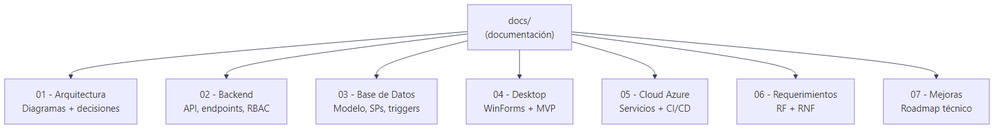
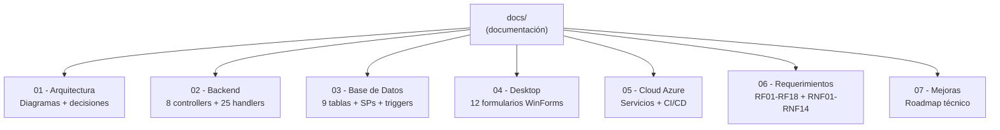

# Documentación — Full Internet Services

Este directorio contiene la documentación técnica completa de la solución, organizada por áreas. Cada subcarpeta tiene un `README.md` que explica el contenido y muestra los diagramas correspondientes.

---

## Mapa de la Documentación

Ver fuente Mermaid

---

## Índice

| # | Sección | Contenido | Actualizado |
|---|---|---|---|
| 01 | [Arquitectura](./01-arquitectura/README.md) | Diagrama general, capas, componentes, despliegue Azure | ✓ |
| 02 | [Backend](./02-backend/README.md) | 8 controllers REST completos, RBAC, EF Core, 25 handlers CQRS, seeder | ✓ |
| 03 | [Base de Datos](./03-base-datos/README.md) | Modelo ER (9 tablas + BITACORA), índices, SPs, triggers, 2 migraciones | ✓ |
| 04 | [Desktop](./04-desktop/README.md) | 12 formularios WinForms, dashboard con menú lateral, consumo de la API | ✓ |
| 05 | [Cloud Azure](./05-cloud-azure/README.md) | Servicios Azure, pipeline CI/CD, separación Dev/QA/Prod | ✓ |
| 06 | [Requerimientos](./06-requerimientos/README.md) | RF01-RF18 con estado real + RNF01-RNF14 + HU01-HU22 + McCall | ✓ |
| 07 | [Mejoras](./07-mejoras/README.md) | Monolito vs microservicios, monitoreo, versionado, caching | ✓ |

---

## Estado de Implementación por RF

| RF | Estado | Dónde |
|---|---|---|
| RF01 — Autenticación | ✓ JWT | `AuthController` + `frmLogin` |
| RF02 — Gestión clientes | ✓ CRUD completo | `ClientesController` + `frmClientes` |
| RF03 — Gestión servicios | ✓ Completo | `PlanesController` + `frmPlanes` |
| RF04 — Planes internet | ✓ Completo | `PlanesController` + `frmPlanes` |
| RF05 — Contratos | ✓ Completo | `ContratosController` + `frmContratos` |
| RF06 — Pagos | ✓ Completo | `PagosController` + `frmPagos` |
| RF07 — Anulación pagos | ✓ Completo | `POST /pagos/anular` + `frmPagos` |
| RF08 — Control mora | ✓ Completo | `GET /reportes/mora` + `frmReportes` |
| RF09 — Reclamos | ✓ Completo | `ReclamosController` + `frmReclamos` |
| RF10 — Clasificación | ✓ Completo | `Clasificacion` en `RegistrarReclamoRequest` |
| RF11 — Asignar técnico | ✓ Completo | `PATCH /reclamos/{id}/tecnico` |
| RF12 — Estado soporte | ✓ Completo | `PATCH /reclamos/{id}/estado` + `frmCambiarEstadoReclamo` |
| RF13 — Grabaciones | Modelo listo | `Reclamo.RutaAudio` — storage roadmap |
| RF14 — Eval técnicos | ✓ Completo | `GET /reportes/tecnicos` + `frmReportes` |
| RF15 — Reportes | ✓ Completo | `ReportesController` (3 endpoints) + `frmReportes` |
| RF16 — Usuarios/roles | ✓ Completo | `UsuariosController` + `frmUsuarios` |
| RF17 — Bitácora | ✓ Completo | `BitacoraOperacion` + migración + `GET /reportes/bitacora` |
| RF18 — Web de pagos | Roadmap | Fase 2 |

---

## Convenciones

- **Diagramas**: todos en formato Mermaid. Las imágenes PNG están en `docs/diagrams/`.
- **Idioma**: toda la documentación, código y comentarios están en **español**.
- **Trazabilidad**: cada decisión arquitectónica referencia el RF/RNF/HU correspondiente del *Proyecto FINAL.pdf*.
- **Idempotencia**: todos los seeders verifican antes de insertar; seguro de ejecutar múltiples veces.

---

## Cómo Visualizar los Diagramas Mermaid

| Entorno | Instrucción |
|---|---|
| GitHub / GitLab | Renderizado nativo en `README.md`. |
| VS Code | Instala "Markdown Preview Mermaid Support" → `Ctrl+Shift+V`. |
| Visual Studio 2022 | Plugin "Markdown Editor" → vista previa automática. |
| Rider | Plugin "Mermaid" → toggle preview en barra de herramientas. |
| CLI | `npx @mermaid-js/mermaid-cli -i input.mmd -o output.png`. |

Los archivos `.mmd` fuente están en `docs/diagrams/` junto a sus imágenes `.png` generadas.
